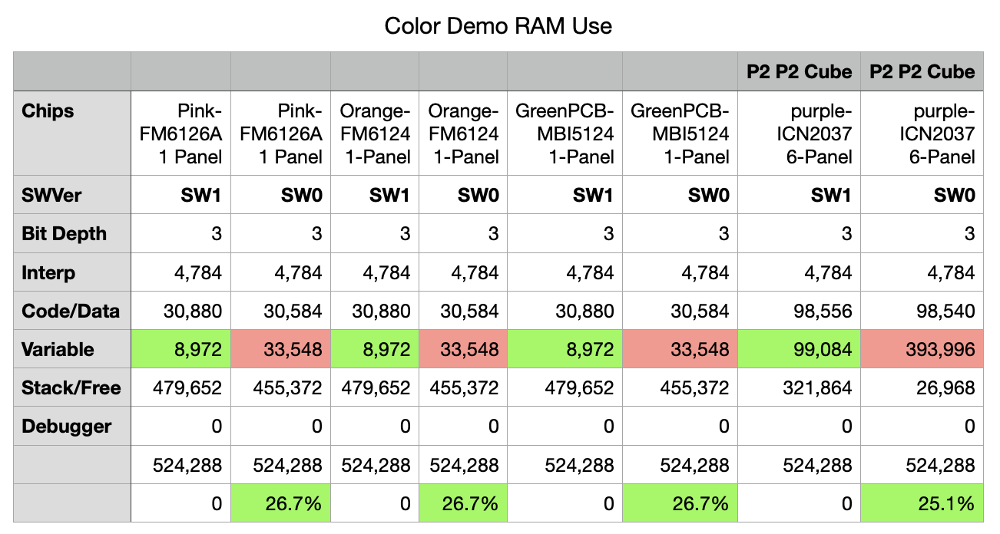

# Change Log

All notable changes to the HUB75 LED Matrix Driver will be documented in this file.

Check [Keep a Changelog](http://keepachangelog.com/) for reminders on how to structure this file. Also, note that our version numbering adheres to [Semantic Versioning](https://semver.org/spec/v2.0.0.html).

### Pages: [README](README.md) | [Hardware Turn-on](HardwareTurnon.md) | [Driver Details](THEOPS.md) | Change Log

## [Unreleased]

Work to appear in upcoming releases:

- Fix multi-panel support for chips that are not yet working in multi-panel form
- I've even some fun animated clocks coming (sorry, I'm been doing software clocks of many, many, forms for a long time.)
- Morphing digits Matrix displays can be found at [P2 LED-Matrix Morphing Digits](https://github.com/ironsheep/P2-LED-Matrix-Morphing-Digits) Repository.

## [2.0.0] 10 Nov 2022

### Multiple HUB75 card support

- Convert initialization: enable support for up to three hub75 cards!
- Rename demos (*now all start with demo_*)
- Add new demos: `demo_hub75_5x7font.spin2` and `demo_hub75_scroll.spin2`
- Upgrade scrolling, now supports scroll directions: `up, down, left, right`
- Added support for New Panel (*same chip as ICN2037 but slightly different setttings, new name is:* **ICN2037_B***: where colors are not swapped and scan is different*)
- Repo README's have been updated: *changed demo file names, changed how configuration is done*.

### Known Issues v2.0.0

- Multi-panel support for the FM6126A and MBI5124 driver chips is not yet working!
- The driver is now fast enough now that there are slight display issues with panels using the MBI5124 chips. We're looking into this.

## [1.0.0] 05 Apr 2022

### Better color presentation, 1/4 RAM usage

- Converted to new PWM generation mechanism allowing compile-time selection of desired display color depth of 3-bit to 8-bit/color (9 to 24bit RGB)
- Now uses 25% of RAM required by previous version for same 4-bit color depth. 
- Frees up ~300kB RAM for our P2 P2 Cube Application
- Latest timing and memory usage info posted.

**NOTE** *SW0 means our older v0.x drivers, while SW1 means our new v1.x driver!*

### Known Issues v1.0.0

- Multi-panel support for the FM6126A and MBI5124 driver chips is not yet working!
- The driver is now fast enough now that there are slight display issues with panels using the MBI5124 chips. We're looking into this.

## [0.9.0] 2021-05-12

### The first release of P2 P2 Cube support

- The driver now works with multiple 64x64 panels using ICN_2037 Chips organized as 1 row. (The P2 P2 Cube is one row with top and bottom panels being the panels at either end of the row.)

### Known Issues v0.9.0

- Multi-panel support for the FM6126A and MBI5124 driver chips is not yet working!
- The driver is now fast enough now that there are slight display issues with panels using the MBI5124 chips. We're looking into this.

## [0.2.0] 2021-02-19

### Our first (limited) Multi-panel support

- Driver rebuilt to work with maximum display width of 1024 pixels.
- Driver now works with new 64x64 panel using ICN_2037 Chips
- Driver now works with display of 128x64 using twin 64x64 panels in series.
- Driver now supports 1/8 scan panels (**P4-1921-8S-V2.0**) using the MBI5124 driver chips

### Known Issues v0.2.0

- Multi-panel support for the FM6126A and MBI5124 driver chips is not yet working!

## [0.1.0] 2020-12-01

### Initial Release - Single Panel

- Single panel support working well, up to 2048 leds (64x32)
- PWM'ing images to achieve reasonable color
- Displaying text in both 5x7 and 8x8 fonts
- Initial version of scrolling text - will get more performant in future updates
- Basic color pixel placement at row, column
- Basic drawing primitives
- Loading and displaying images from .bmp files (that are identically sized to your panel)

## History: Progress heading toward initial release

**30 Nov 2020:** After being distracted by designing and sourcing the Eval Adapter boards I'm finally working on the driver once again.

- rundimentary scrolling text is now working
- multiple panel types are now supported (will add more as users identify the need)

**26 Nov 2020:** v1.4 PCB order placed for production run.

**16 Nov 2020:** v1.3 (green) PCB's arrived today these are better mechanical fit and have plated vias on the EVal board connectors.  This is a final form and function run before we go to production.

**20 Oct 2020:** I've made wonderful advances in this past week.

Things now working are:

- Loading and displaying images from .bmp files
- PWMing images to achieve reasonable color (initial draft)
- Displaying text in both 5x7 and 8x8 fonts

Here you can see a demonstration of the 16-bit pwm color. Of course these panels are amazingly bright. I'm running here at ~50% brightness and it's still overwhelming the camera in a lighted room.

**27 Oct 2020:** More engineering and the (red) boards arrive!

This week I've been:

- Working to formally structure the code for release
- Studied gamma correction and now have a better performing table in place
- Studied PWM for the LEDs and now have a much more accurate PWM in place (colors are looking much better)
- Have been working on more tests, demos for animation rates of display
- More videos will be coming, meanwhile, have you seen these? [YouTube Playlist for Propeller Related Videos](https://www.youtube.com/playlist?list=PLkXxMjp58T0pk1dd8pH1OV7NCf-8Tbx1M)
- **Exciting!** The initial run of the Adapter PCBs arrived!
- I checked them out mechanically, soldered the parts to one, then checked it out electrically and lastly started using it!  It came up beautifully! (*See pictures and turn on description below*)
