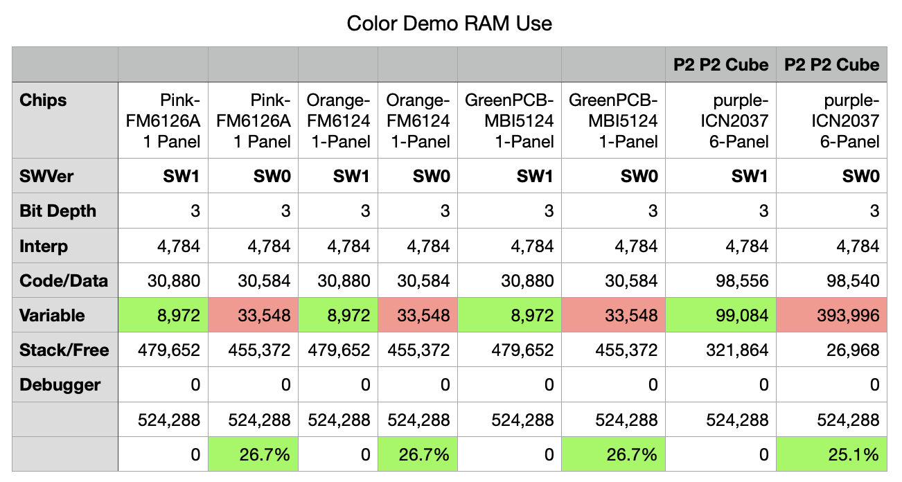

# Change Log

All notable changes to the HUB75 LED Matrix Driver will be documented in this file.

Check [Keep a Changelog](http://keepachangelog.com/) for reminders on how to structure this file. Also, note that our version numbering adheres to [Semantic Versioning](https://semver.org/spec/v2.0.0.html).

### Pages: [README](README.md) | [Hardware Turn-on](HardwareTurnon.md) | [Driver Details](THEOPS.md) | [Wiring Guide](DOCs/WiringGuide.md) | Change Log

## [4.0.0] 02 Oct 2026

### Wiring sentences, a cube layer, and one-call adapter startup

Each panel is described by one sentence, each adapter starts with one call, and six panels can draw as one cube. To convert v3.x code, follow the [Update to v4.0 Checklist](Checklist-v3-v4.md).

#### Breaking Changes

- **BREAKING**: `DISPx_MAX_PANELS_PER_ROW`, `DISPx_MAX_PANELS_PER_COLUMN`, `DISPx_WIRE_ENTRY`, `DISPx_WIRE_TRAVERSE` and `DISP0_PANEL0_ROT` to `DISP0_PANEL3_ROT` are removed. Describe each panel in a wiring sentence, `DISPx_C0` to `DISPx_C15`; a v3.x `isp_hub75_hwPanelConfig.spin2` does not compile.
- **BREAKING**: `display.start()` takes the adapter ID, `display.start(hub75Bffrs.HUB75_ADAPTER_1)`, in place of the v3.x sequence. `configure()`, `setWireConfig()` and `setBufferPointers()` are removed, and your program no longer names the buffers object.
- **BREAKING**: `isp_hub75_hwBufferAccess.spin2` and `isp_hub75_hwBuffers.spin2` are never edited. Restore the release copies; a second or third adapter needs only its `DISP1_` or `DISP2_` settings.
- **BREAKING**: panel-centric calls (`fillPanel()`, `setCursorOnPanel()`, `drawPanelBox()`, `drawPanelLine()`, `scrollColoredTextOnLnOfNPanels()` and their siblings) take panel positions: `P0` is the top-left panel as the display hangs, numbered in reading order. A program that numbered panels by their place in the buffer must renumber; on a display wired from the bottom-left, `fillPanel(0)` now fills the top-left panel.
- **BREAKING**: `DISPx_ROTATION` states how the display is mounted: `ROT_RIGHT_90` is hung turned 90 degrees clockwise, and content is drawn to read upright as hung. A program that sets a rotation should re-check it against how the display hangs.
- **BREAKING**: `wireStart()`, `wireTraverse()`, `wireOrderForPanel()`, `displayPanelForWire()`, `needsPanelColumnSwap()`, `panelRotationAt()`, `displayToPanelCoords()`, `panelPixelOffset()` and `indexToPanel()` are removed from `isp_hub75_hwBufferAccess.spin2`, and `panelRotation()` is `displayRotation()`. Programs that draw through the display object need no change.

#### Added

- **Wiring sentences**, `DISPx_C0` to `DISPx_C15`: `direction | neighbour | arrow` places a panel next to an earlier one and says which way its arrow points; `C0` is `FIRST_PANEL | arrow`, and unused positions are `NO_PANEL`. Rows, a 2x2 in Z or serpentine order, 3x2 and L shapes are described the same way.
- **Startup check**: each wiring mistake prints one `HUB75:` line naming the setting, then startup stops. A correct config prints a picture of the grid it derived. Every message is listed in the [Wiring Guide](DOCs/WiringGuide.md#startup-messages).
- **Cube display**: `DISPx_SHAPE = hwEnum.SHAPE_CUBE` with `DISPx_CUBE_TOP` and `DISPx_CUBE_FRONT` turns six square panels wired as a cube net into a cube. `drawFacePixel()`, `drawFaceLine()`, `drawFaceBox()`, `drawFaceCircle()`, `drawFaceTextAtRC()` and `scrollFaceTextAtRC()` draw across all 12 edges.
- **Identify screen**, `demo_hub75_numberPanels.spin2`: labels each panel with its cable position, its panel position and an arrow, to fill in and confirm the sentences.
- **Multiple adapters without file edits**: describe the second or third adapter's panels in `DISP1_` or `DISP2_` and start it with its own `display.start()`; an adapter with no panels costs no memory.
- **Driver limits**: the [Wiring Guide](DOCs/WiringGuide.md#driver-limits) gives the most panels one adapter can drive for each panel type, and the startup check reports a display over the limit.
- `placeBMP(chain, file, rotation)` places an image of any size, turned by a content rotation (`ROT_NONE`, `ROT_RIGHT_90`, `ROT_LEFT_90` or `ROT_180`).
- **Demo**: `demo_hub75_boundary.spin2` draws across panel seams and prints the time of one full draw.

#### Fixed

- Chains of ten or more panels on one adapter show every panel. Chains of nine or fewer were unaffected.
- More than one quarter-scan panel (the `SCAN_4` chips: MBI5124GP, DP5125D, ICN2038S) in one chain converts panel by panel. A single panel was unaffected.
- Each display shows its own adapter's image. With more than one adapter, every display showed the first adapter's image; single-adapter programs were unaffected.
- `ROT_RIGHT_90` and `ROT_LEFT_90` draw inside the display, and `maxDisplayColumns()`, `maxDisplayRows()` and `displaySizeInPixels()` report the size as mounted. Setting either rotation on a non-square display used to draw past its edge.
- Text and scrolling that cross a vertical panel seam land whole on a display wired from the bottom-left in Z order. Their two halves had come out swapped.
- Panel-centric calls land on the panel they name on that same layout: `fillPanel(0)` fills the top-left panel, and a panel-centric line stops at its panel's edge instead of spilling onto a neighbour.

#### Changed

- Buffers are sized by the number of panels in use, not by the display's bounding box. A display with a gap (an L shape) holds no memory for the gap.

### Known Issues v4.0.0

- The cube is checked by a 163-case fold self-test that runs on the P2 with no panels attached (`test_hub75_cube_fold.spin2`). It has not yet run on six real panels.
- Multiple quarter-scan panels (the green MBI5124GP panels), chains of more than nine panels, and two adapters cabled at once are checked by buffer-level tests on the P2, not yet on panels.
- Only the ICN2037 128x64 panel type has been run with this release. The driver limits for every other type are calculated, and refresh has been measured only for that type (full color cycle: 177 Hz at 3-bit, 82 at 4-bit, 40.1 at 5-bit, 19.7 at 6-bit, 9.6 at 7-bit, 4.6 at 8-bit).
- Colors whose light sits mostly in the top bit, near half brightness, shimmer at 5-bit and above on that rig; 4-bit was steady. Use 4-bit or less where a steady image matters.
- The scan setting of the ICN2038S is disputed: the driver sets `SCAN_4` (four rows lit at once), while its five address lines suggest 1/32 scan. The panel-count limit for this chip follows the driver's setting.

## [3.0.3] 11 Jun 2026

### Clock-independent timing, 2x2 panel grids, per-panel rotation, color fixes

This release unifies the `develop` feature branch into `main`. (Version numbering
catches up here: the prior heading was `[3.0.1]` while release tags had reached
`v3.0.2`; this `[3.0.3]` entry both reconciles that gap and records the unified build.)

#### Breaking Changes

- **BREAKING**: pin groups are renamed `PINS_Pxx_Pyy` to `PIN_GROUP_Pxx_Pyy`, and only
  the three valid 16-pin groups remain (P0-P15, P16-P31, P32-P47). Update
  `ADAPTER_BASE_PIN` in `isp_hub75_hwPanelConfig.spin2`; an old name will not compile.

#### Added

- **Clock-frequency-independent panel timing** - HUB75 signal timing is now derived
  from the system clock, so panels drive correctly across different `_clkfreq`
  settings instead of assuming a fixed frequency.
- **2x2 panel-grid support** - display-level drawing now spans 2-D panel grids
  (e.g., four panels in a 2x2 arrangement), with Z-pattern / serpentine wire-order
  mapping from display coordinates to physical panel wiring.
- **Per-panel rotation and wire-order** - individual panels within a grid can be
  rotated (`ROT_NONE` / `ROT_180` / `ROT_LEFT_90` / `ROT_RIGHT_90`) and remapped to
  physical wire order, in addition to the existing whole-display rotation.
- **New demos** - `demo_hub75_quadPanel.spin2`, `demo_hub75_multi2x2panel.spin2`,
  `demo_hub75_numberPanels.spin2`, and the `test_hub75_pin_identify.spin2` bring-up
  utility.

#### Fixed

- **5-bit color depth** rendering corrected.
- **MSB-black artifact** - colors missing the most-significant bit no longer render
  black at certain brightness levels (brightness rounding now rounds to nearest).

#### Changed

- Repo-wide conformance to the project Spin2 authoring guide (no change to emitted
  behavior), and consolidation of the documentation tree under `DOCs/`.

### Known Issues v3.0.3

- Multi-panel support for some driver chips (e.g., MBI5124GP, FM6126A) is still being
  worked out; single-panel use of these chips works.

## [3.0.1] 15 Jan 2024

### New chip support and new fonts

- Add support for panels using **DP5125D** chips
- Add Chips' 5x7 dithered fonts
- ICN2037_B was renamed to **ICN2038S** 
- MBI5124_8S was renamed to **MBI5124GP**
- Rearranged user configurable files in order to improve compilation under Pnut/Propeller Tool - This allows us to support many more total pixels (now 64k) in a display.

### Known Issues v3.0.1

- Multi-panel support for the MBI5124 driver chips is not yet working!
- The driver is now fast enough now that there are slight display issues with panels using the MBI5124 chips. We're looking into this.

## [2.0.0] 10 Nov 2022

### Multiple HUB75 card support

- Convert initialization: enable support for up to three hub75 cards!
- Rename demos (*now all start with demo_*)
- Add new demos: `demo_hub75_5x7font.spin2` and `demo_hub75_scroll.spin2`
- Upgrade scrolling, now supports scroll directions: `up, down, left, right`
- Added support for New Panel (*same chip as ICN2037 but slightly different setttings, new name is:* **ICN2037_B***: where colors are not swapped and scan is different*)
- Repo README's have been updated: *changed demo file names, changed how configuration is done*.

### Known Issues v2.0.0

- Multi-panel support for the FM6126A and MBI5124 driver chips is not yet working!
- The driver is now fast enough now that there are slight display issues with panels using the MBI5124 chips. We're looking into this.

## [1.0.0] 05 Apr 2022

### Better color presentation, 1/4 RAM usage

- Converted to new PWM generation mechanism allowing compile-time selection of desired display color depth of 3-bit to 8-bit/color (9 to 24bit RGB)
- Now uses 25% of RAM required by previous version for same 4-bit color depth. 
- Frees up ~300kB RAM for our P2 P2 Cube Application
- Latest timing and memory usage info posted.

**NOTE** *SW0 means our older v0.x drivers, while SW1 means our new v1.x driver!*

### Known Issues v1.0.0

- Multi-panel support for the FM6126A and MBI5124 driver chips is not yet working!
- The driver is now fast enough now that there are slight display issues with panels using the MBI5124 chips. We're looking into this.

## [0.9.0] 2021-05-12

### The first release of P2 P2 Cube support

- The driver now works with multiple 64x64 panels using ICN_2037 Chips organized as 1 row. (The P2 P2 Cube is one row with top and bottom panels being the panels at either end of the row.)

### Known Issues v0.9.0

- Multi-panel support for the FM6126A and MBI5124 driver chips is not yet working!
- The driver is now fast enough now that there are slight display issues with panels using the MBI5124 chips. We're looking into this.

## [0.2.0] 2021-02-19

### Our first (limited) Multi-panel support

- Driver rebuilt to work with maximum display width of 1024 pixels.
- Driver now works with new 64x64 panel using ICN_2037 Chips
- Driver now works with display of 128x64 using twin 64x64 panels in series.
- Driver now supports 1/8 scan panels (**P4-1921-8S-V2.0**) using the MBI5124 driver chips

### Known Issues v0.2.0

- Multi-panel support for the FM6126A and MBI5124 driver chips is not yet working!

## [0.1.0] 2020-12-01

### Initial Release - Single Panel

- Single panel support working well, up to 2048 leds (64x32)
- PWM'ing images to achieve reasonable color
- Displaying text in both 5x7 and 8x8 fonts
- Initial version of scrolling text - will get more performant in future updates
- Basic color pixel placement at row, column
- Basic drawing primitives
- Loading and displaying images from .bmp files (that are identically sized to your panel)

## History: Progress heading toward initial release

**30 Nov 2020:** After being distracted by designing and sourcing the Eval Adapter boards I'm finally working on the driver once again.

- rundimentary scrolling text is now working
- multiple panel types are now supported (will add more as users identify the need)

**26 Nov 2020:** v1.4 PCB order placed for production run.

**16 Nov 2020:** v1.3 (green) PCB's arrived today these are better mechanical fit and have plated vias on the EVal board connectors.  This is a final form and function run before we go to production.

**20 Oct 2020:** I've made wonderful advances in this past week.

Things now working are:

- Loading and displaying images from .bmp files
- PWMing images to achieve reasonable color (initial draft)
- Displaying text in both 5x7 and 8x8 fonts

Here you can see a demonstration of the 16-bit pwm color. Of course these panels are amazingly bright. I'm running here at ~50% brightness and it's still overwhelming the camera in a lighted room.

**27 Oct 2020:** More engineering and the (red) boards arrive!

This week I've been:

- Working to formally structure the code for release
- Studied gamma correction and now have a better performing table in place
- Studied PWM for the LEDs and now have a much more accurate PWM in place (colors are looking much better)
- Have been working on more tests, demos for animation rates of display
- More videos will be coming, meanwhile, have you seen these? [YouTube Playlist for Propeller Related Videos](https://www.youtube.com/playlist?list=PLkXxMjp58T0pk1dd8pH1OV7NCf-8Tbx1M)
- **Exciting!** The initial run of the Adapter PCBs arrived!
- I checked them out mechanically, soldered the parts to one, then checked it out electrically and lastly started using it!  It came up beautifully! (*See pictures and turn on description below*)
