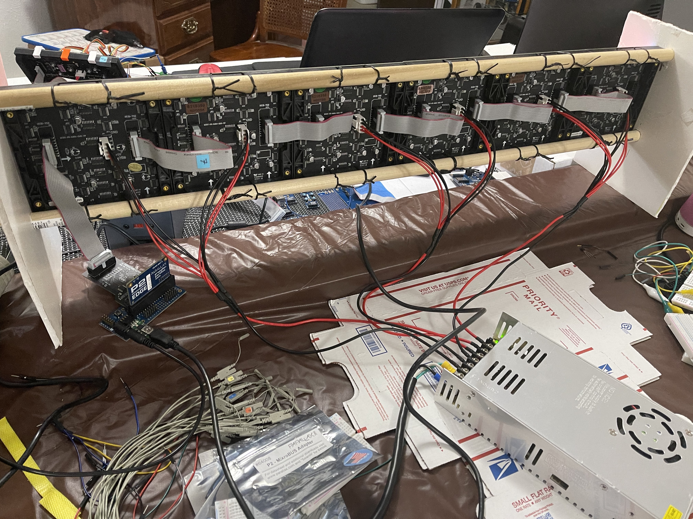
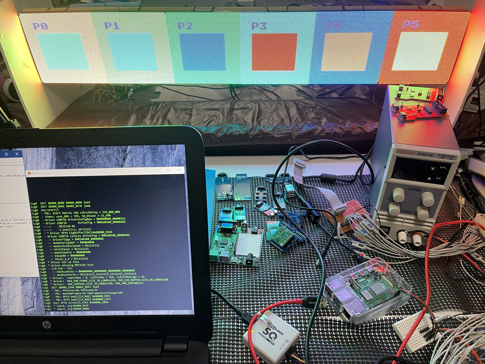
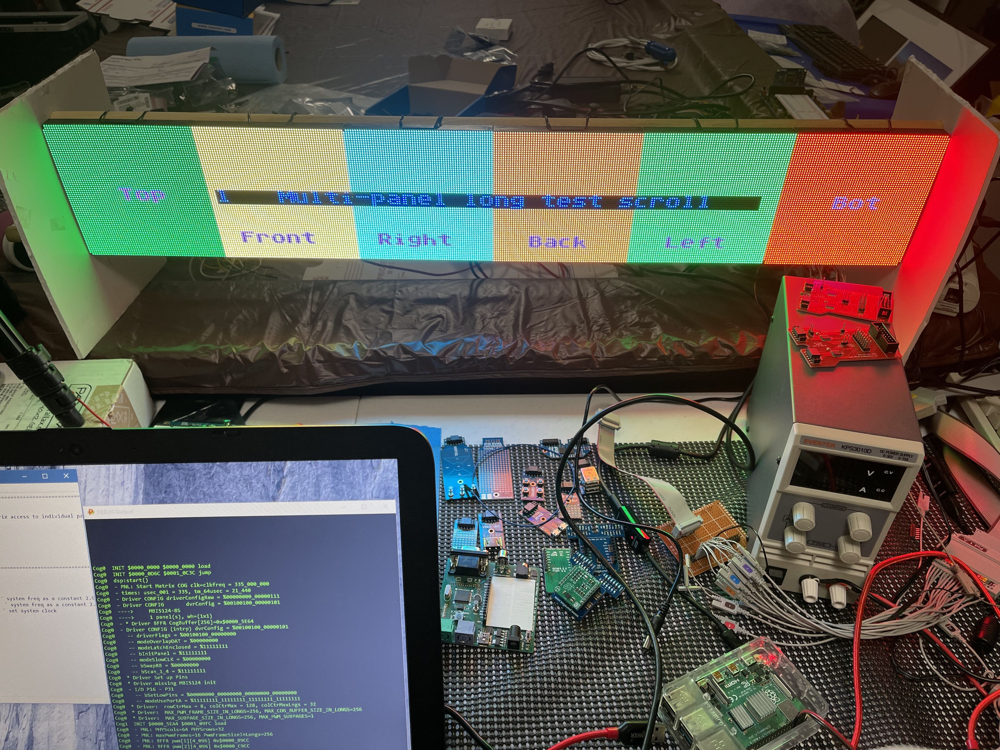
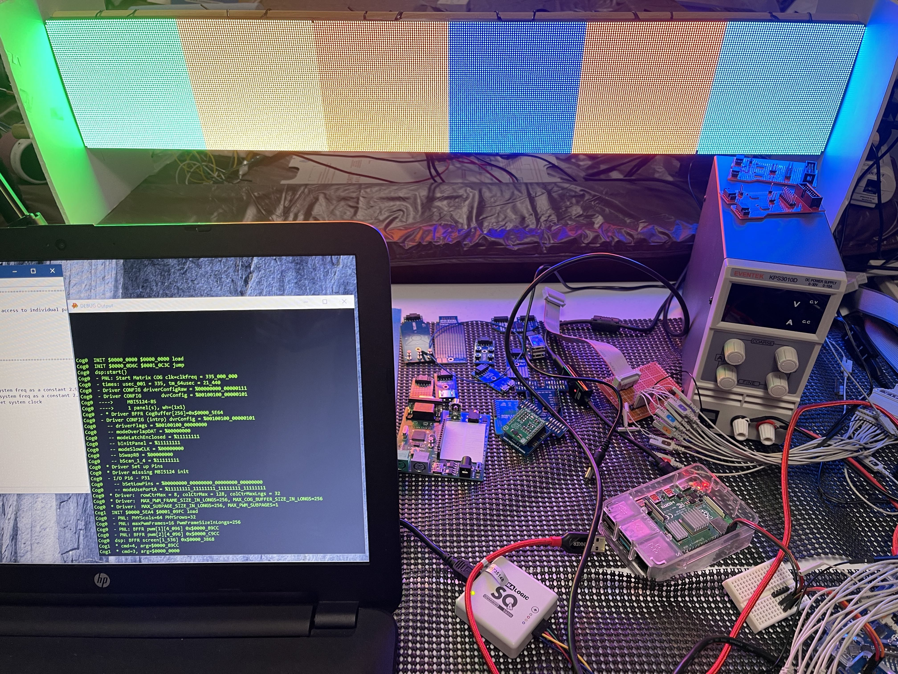

# P2 P2 Cube Test Hardware - turn-on images

![Project Maintenance][maintenance-shield]

One of the projects the P2 community is working on is a 6-sided cube of 64x64 panels.  I'm certifying the driver for use on this P2 Cube project. 

The P2 Forum Thread is found here: [P2 P2 Cube](https://forums.parallax.com/discussion/172696/p2-p2-cube/p1) 

And the repository for design and physical objects is found here [Repository: P2 P2 Cube](https://github.com/jshook/p2_p2_cube)

This is the back of my 6 x 64x64 panel driven with a 5V 60A power supply so we can test full display Brightness. 

This is a snapshot of the 6 x 64x64 panel showing the driver configured for a single panel display - the pic is a shot of an animation taking place. The 1/6th panel to the right contains the correct display the remaing 5 panels to the left are receiving the same data... just one for offset for each further panel to the left.

Mark each panel with unique content.

Trying scrolling text around what would be the sides of the cube.

Repait panels in a loop (you can't see here) so the panels individually change colors randomly.

----

If you like my work and/or this has helped you in some way then feel free to help me out for a couple of :coffee:'s or :pizza: slices!

----

## License

Copyright © 2020 Iron Sheep Productions, LLC. All rights reserved. 
Licensed under the MIT License.  
 
Follow these links for more information:

### [Copyright](copyright) | [License](LICENSE)

[maintenance-shield]: https://img.shields.io/badge/maintainer-stephen%40ironsheep.biz-blue.svg?style=for-the-badge

[license-shield]: https://camo.githubusercontent.com/bc04f96d911ea5f6e3b00e44fc0731ea74c8e1e9/68747470733a2f2f696d672e736869656c64732e696f2f6769746875622f6c6963656e73652f69616e74726963682f746578742d646976696465722d726f772e7376673f7374796c653d666f722d7468652d6261646765

[releases-shield]: https://img.shields.io/github/release/ironsheep/p2-LED-Matrix-Driver.svg?style=for-the-badge

[releases]: https://github.com/ironsheep/P2-HUB75-LED-Matrix-Driver/releases
