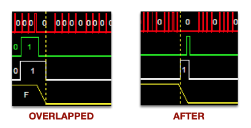
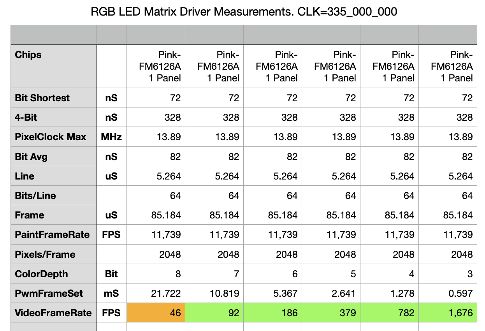
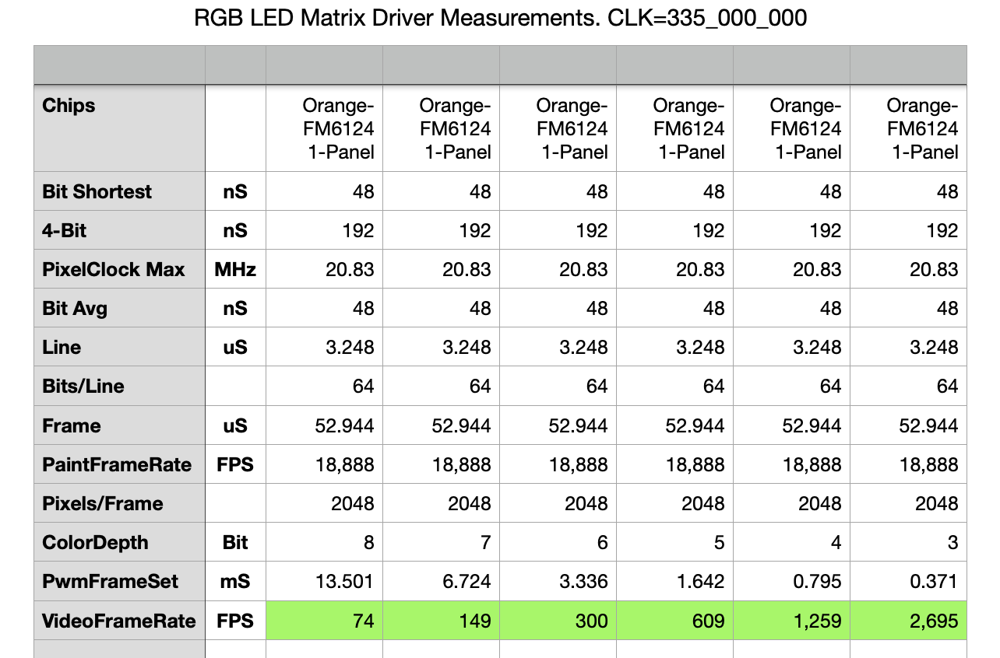
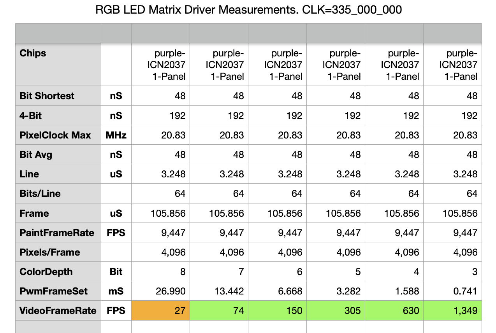
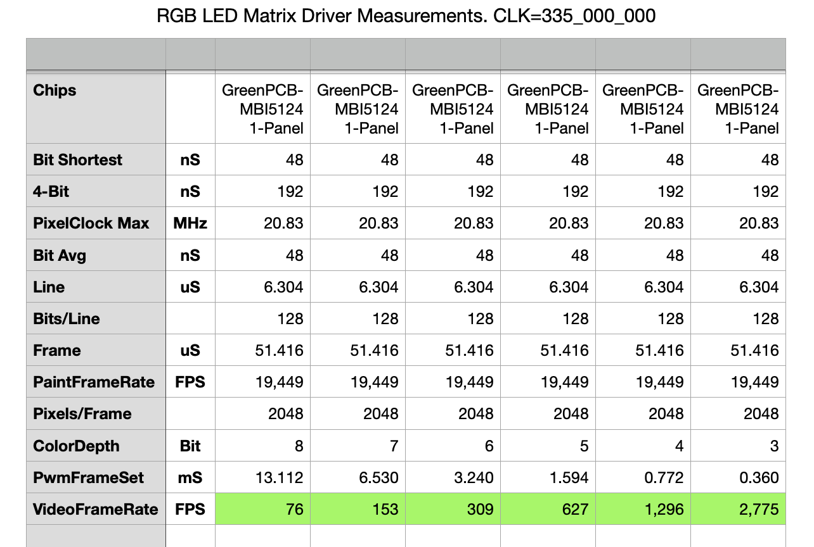
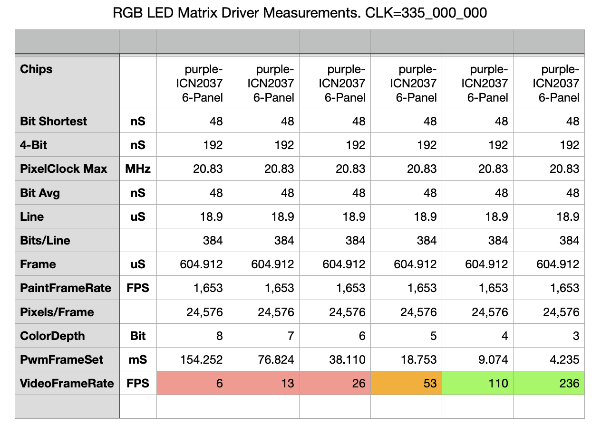

# HUB75 Driver - configuring for a chip we haven't seen yet

![Project Maintenance][maintenance-shield]

NOTE: this is NEW information as of v1.x! It applies to v1.0.x and later.  An older version is here: [Sofware Ver0.x Timings](HUB75-Driver-SWver0.md)

## Intent

The P2 HUB75 backend-end driver has configuration values we place in the files: **isp\_hub75_hwGeometry.spin2** and **isp\_hub75_hwBuffers.spin2**.  This page presents more detail of what's happening behind the scenes for some of these configurable values.

## Driver Adjustable Settings for given Panel

The driver currently offers the following adjustments:

| Purpose           |  Value Choices |  Description
|-----------------|-------------|-----|
| LATCH_STYLE | OFFSET, ENCLOSED | Adjust the waveform of Latch & OE! |
| LATCH_POSITION | OVERLAPPED  with the Last Bits of the row AFTER the last bits of the row | When should the latch occur relative to the bits for each row? |
| INIT_PANEL | True, [False] | The Driver chips on this panel require/support a configuration stream prior to normal operation (e.g., FM6126A, FM6126Q, FM6127, and MBI5124)
| WIDER_CLOCK | True, [False] | Inject a wait during the high portion of the data clock (ICN2037 Has 20MHz limit)
| RB_SWAP | True, [False] | It seems that our 64x64 panel requires the red and blue lines to be swapped
| GB_SWAP | True, [False] | The ICN2037 (not _B variant) panels requires the green and blue lines to be swapped
| SCAN\_4 | True, [False] | By default [False] the driver sends half the panel pixels over the each of the two sets of RGB lines (RGB1,RGB2), A 1/8th scan panel however [True] sends two diff regions of 1/4 of the panel which is a different pixel ordering.
| ADAPTER\_BASE_PIN | 0-15, 16-31, 32-47, 48-63 [*no default*] | compile driver to use specific header pair to which the HUB75 Adapater card is attached

### Composite Selections (by Chip id)

The chip types are collections of the above settings which make it easier to get the settings correct for your panel by specifying a single chip ID versus a mix of the above option.

| Chip Type           |  settings used
|---|---|
| CHIP_FM6126A = | <PRE>CHIP\_MANUAL\_SPEC, LAT\_POSN\_OVERLAP, LAT\_STYLE\_OFFSET, INIT\_PANEL\_REQUIRE</PRE>
| CHIP_GS6238S = | <PRE>CHIP\_MANUAL\_SPEC, LAT\_POSN\_OVERLAP, LAT\_STYLE\_OFFSET, GB\_SWAP</PRE>
| CHIP\_MBI5124_8S = | <PRE>CHIP\_MANUAL\_SPEC, CHIP\_UNK\_LAT\_END\_ENCL, SCAN\_4, INIT\_PANEL\_REQUIRED</PRE>
| CHIP_FM6124 = |<PRE>CHIP\_MANUAL\_SPEC</PRE>
| CHIP_ICN2037 = |<PRE>CHIP\_MANUAL\_SPEC, CLK\_WIDE\_PULSE, RB_SWAP</PRE>
| CHIP_ICN2038S = | <PRE>CHIP\_MANUAL\_SPEC, CLK\_WIDE\_PULSE, SCAN_4</PRE>
| CHIP_DP5125D = | <PRE>CHIP\_MANUAL\_SPEC, LAT\_POSN\_OVERLAP, LAT\_STYLE\_OFFSET, SCAN_4</PRE>

When trying to identify what needed for an as-of-yet unidentified chip then you will likely want to find the closest chip that sort of works then convert to the expanded set and tweak the selections 1 by 1 to see if a better mix of drive styles will work.

### PURPOSE: LATCH_STYLE

The driver has two built-in LATCH, OE! styles supporting the hardware we've seen to date.

**FIGURE 1: LATCH_STYLE: OFFSET (left), ENCLOSED (right)**

#### LEGEND

| Signal | Color |
|-----|-----|
| LATCH | Green |
| OE! | White |
| ADDR | Yellow |

In the OFFSET case: we see OE! going high, we see the row address changing and then we see LATCH going high which latches the serial data into the chip. Then we see the OE! going low, followed by the LATCH going low.  However, in the ENCLOSED case the LATCH signal goes low before the OE! goes low.

### PURPOSE: LATCH_POSITION

The driver supoorts two forms of latch position:

**FIGURE 1: LATCH_POSITION: OVERLAPPED (left), AFTER (right)**

#### LEGEND

| Signal | Color |
|-----|-----|
| CLK | Red |
| LATCH | Green |
| OE! | White |
| ADDR | Yellow |

In the OVERLAPPED case: we see LATCH going high before the start of the three last serial bits of the row and ending after the last serial data bit.  However, in the AFTER case we see the LATCH signal going high after the final serial bit of the row is sent.

## Driver configuration by chip type (S/W Ver 1.x and later Timings)

In this section we are recording the configuration we've shown that works for each of the following driver chips we've seen used in the panels.  As you identify more, please file an issue telling us the settings you found that work with your panels' driver chip. And we'll add the new details to this document for us all to see.  *When you file and issue we'll also upgrade the driver in a later release to officially support the new driver chip you've gotten working.*

### Driver Chip: FM6126A

This is the most complicated of the driver chips to date. These chips don't turn on reliably until they've been configured which is a process nearly the same as writing a single row of data but with special meaning to the bit stream and special latch timing. This Chip supports faster data CLK (Max 30MHz)

- LATCH_STYLE: OFFSET
- LATCH_POSITION: OVERLAPPED
- CONFIGURE_PANEL: True
- WIDER_CLOCK: False
- RED\_BLUE_SWAP: False
- SCAN_4: False

Signal Timings - 64x32 panel - for driver v1.x (and later):

**NOTE** *the orange indicates a frame-rate less than 60Hz so you may see some flicker.*

---

### Driver Chip: FM6124 (UNKNOWN)

This is the most simple chip form. This chip also supports faster data CLK (Max 30MHz) although the driver doesn't, yet.

- LATCH_STYLE: ENCLOSED
- LATCH_POSITION: AFTER
- CONFIGURE_PANEL: False
- WIDER_CLOCK: False
- RED\_BLUE_SWAP: False
- SCAN_4: False

Signal Timings - 64x32 panel - for driver v1.x (and later):

**NOTE** *the green indicates a frame-rate greater than 60Hz for all color depths*

---

### Driver Chip: ICN2037 (UNKNOWN)

This is nearly the same as the FM6124 but needs a slower data CLK (Max 20MHz) (wider pulse width) and our 64x64 panels appear to need Red/Blue swapped!?.

- LATCH_STYLE: ENCLOSED
- LATCH_POSITION: AFTER
- CONFIGURE_PANEL: False
- WIDER_CLOCK: True
- RED\_BLUE_SWAP: True
- SCAN_4: False

Signal Timings - 64x64 panel - for driver v1.x (and later):

**NOTE** *the orange indicates a frame-rate less than 60Hz so you may see some flicker.*

---
### Driver Chip: ICN2037_B (UNKNOWN)

(Added in v2.0.0 of the driver)

This is nearly the same as the FM6124 but needs a slower data CLK (Max 20MHz) (wider pulse width) and unlike the ICN2037 this instance of P4 64x64 panel that I tested DOES NOT have Red/Blue swapped but DOES need SCAN_4 enabled.

- LATCH_STYLE: ENCLOSED
- LATCH_POSITION: AFTER
- CONFIGURE_PANEL: False
- WIDER_CLOCK: True
- RED\_BLUE_SWAP: **False** *(diff from ICN2037)*
- SCAN_4: **True** *(diff from ICN2037)*

Signal Timings - 64x64 panel - for driver v1.x (and later):

**NOTE** *the orange indicates a frame-rate less than 60Hz so you may see some flicker.*

---

### Driver Chip: MBI5124_8S (MBI5124 but panel is 1/8 scan)

This is nearly the same as the FM6124 but but halves the number of address lines which is normally panel rows / 2, but in this case is panel rows / 4. It also clocks out 2x the number of pixels per row.

*NOTE: The MBI5124 does support configuration but it appears that it is already configured at power-up so this driver does not attempt to configure the panel currently. The setting CONFIGURE_PANEL is marked as true so if we add configuration later the driver will use it.*

- LATCH_STYLE: ENCLOSED
- LATCH_POSITION: AFTER
- CONFIGURE_PANEL: True
- WIDER_CLOCK: False
- RED\_BLUE_SWAP: False
- SCAN_4: True

Signal Timings - 64x32 panel - for driver v1.x (and later):

**NOTE** *the green indicates a frame-rate greater than 60Hz for all color depths*

----

### Driver Chip: ICN2037 (UNKNOWN) for P2 P2 Cube

This is nearly the same as the FM6124 but needs a slower data CLK (Max 20MHz) (wider pulse width) and our 64x64 panels need Red/Blue swapped.
**NOTE** However, I'm successfully clocking the panels at 28.6 MHz (which is faster than the panel 20 MHz max.) while clocking the P2 at 335 MHz.

- LATCH_STYLE: ENCLOSED
- LATCH_POSITION: AFTER
- CONFIGURE_PANEL: False
- WIDER_CLOCK: True
- RED\_BLUE_SWAP: True
- SCAN_4: False

Signal Timings - 64x32 panel x 6! - for driver v1.x (and later).

**NOTE** *the ORANGE indicates a frame-rate less than 60Hz so you may see some flicker while the RED indicates the flicker is really drammatic!*

A single PWM Frame consists of writing 32 - 384 pixel lines (which paint to the top 32 and bottom 32 rows at the same time.)

When this driver is configured for the P2 P2 Cube (1 chain of 6 64x64 pixel panels) the driver copies two lines of PWM data from Hub RAM to COG RAM, clocks out the two rows then fetches the next 2 rows. Within the driver code these two-row groups are called subFrames. For the 6x64x64 panel-set there are 16 of these subFrames for each PWM Frame. There are N PWM Frames creating what we know as a single video frame. Where the N is is 2^{color-depth} number of frames  and {color-depth} set by your COLOR_DEPTH compile time value.

----

> If you find this kind of written explanation useful, helpful I would be honored by your helping me out for a couple of :coffee:'s or :pizza: slices -or- you can support my efforts by contributing at my Patreon site!
>
>  &nbsp;&nbsp; -OR- &nbsp;&nbsp; [Patreon.com/IronSheep](https://www.patreon.com/IronSheep?fan_landing=true)

----

## License

Copyright © 2020 Iron Sheep Productions, LLC. All rights reserved. 
Licensed under the MIT License.  
 
Follow these links for more information:

### [Copyright](copyright) | [License](LICENSE)

[maintenance-shield]: https://img.shields.io/badge/maintainer-stephen%40ironsheep.biz-blue.svg?style=for-the-badge

[license-shield]: https://camo.githubusercontent.com/bc04f96d911ea5f6e3b00e44fc0731ea74c8e1e9/68747470733a2f2f696d672e736869656c64732e696f2f6769746875622f6c6963656e73652f69616e74726963682f746578742d646976696465722d726f772e7376673f7374796c653d666f722d7468652d6261646765

[releases-shield]: https://img.shields.io/github/release/ironsheep/p2-LED-Matrix-Driver.svg?style=for-the-badge

[releases]: https://github.com/ironsheep/p2-LED-Matrix-Driver/releases
