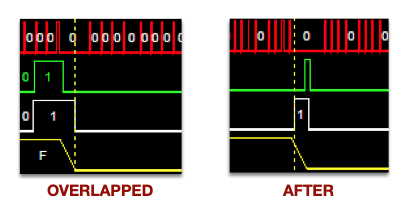

# HUB75 Driver - configuring for a chip we haven't seen yet

![Project Maintenance][maintenance-shield]

## Intent

The P2 HUB75 backend-end driver has configuration values we place in the file: **isp_hub75_hwGeometry.spin2**.  This page presents more detail of what's happening behind the scenes for some of these configurable values.

## Driver Adjustable Settings for given Panel

The driver currently offers the following adjustments:

| Purpose           |  Value Choices |  Description
|-----------------|-------------|-----|
| LATCH_STYLE | OFFSET, ENCLOSED | Adjust the waveform of Latch & OE! |
| LATCH_POSITION | OVERLAPPED  with the Last Bits of the row AFTER the last bits of the row | When should the latch occur relative to the bits for each row? |
| INIT_PANEL | True, [False] | The Driver chips on this panel require/support a configuration stream prior to normal operation (e.g., FM6126A, FM6126Q, FM6127, and MBI5124)
| WIDER_CLOCK | True, [False] | Inject a wait during the high portion of the data clock (ICN2037 Has 20MHz limit)
| RED\_BLUE_SWAP | True, [False] | It seems that our 64x64 panel requires the red and blue lines to be swapped
| SCAN\_4 | True, [False] | By default [False] the driver sends half the panel pixels over the each of the two sets of RGB lines (RGB1,RGB2), A 1/8th scan panel however [True] sends two diff regions of 1/4 of the panel which is a different pixel ordering. 
| ADAPTER\_BASE_PIN | 0-15, 16-31, 32-47, 48-63 [*no default*] | compile driver to use specific header pair to which the HUB75 Adapater card is attached

### PURPOSE: LATCH_STYLE

The driver has two built-in LATCH, OE! styles supporting the hardware we've seen to date.

**FIGURE 1: LATCH_STYLE: OFFSET (left), ENCLOSED (right)**

#### LEGEND

| Signal | Color |
|-----|-----|
| LATCH | Green |
| OE! | White |
| ADDR | Yellow |

In the OFFSET case: we see OE! going high, we see the row address changing and then we see LATCH going high which latches the serial data into the chip. Then we see the OE! going low, followed by the LATCH going low.  However, in the ENCLOSED case the LATCH signal goes low before the OE! goes low.

### PURPOSE: LATCH_POSITION

The driver supoorts two forms of latch position:

**FIGURE 1: LATCH_POSITION: OVERLAPPED (left), AFTER (right)**

#### LEGEND

| Signal | Color |
|-----|-----|
| CLK | Red |
| LATCH | Green |
| OE! | White |
| ADDR | Yellow |

In the OVERLAPPED case: we see LATCH going high before the start of the three last serial bits of the row and ending after the last serial data bit.  However, in the AFTER case we see the LATCH signal going high after the final serial bit of the row is sent.

## Driver configuration by chip type

In this section we are recording the configuration we've shown that works for each of the following driver chips we've seen used in the panels.  As you identify more, please file an issue telling us the settings you found that work with your panels' driver chip. And we'll add the new details to this document for us all to see.

### Driver Chip: FM6126A

This is the most complicated of the driver chips to date. These chips don't turn on reliably until they've been configured which is a process nearly the same as writing a single row of data but with special meaning to the bit stream and special latch timing. This Chip supports faster data CLK (Max 30MHz)

- LATCH_STYLE: OFFSET
- LATCH_POSITION: OVERLAPPED 
- CONFIGURE_PANEL: True
- WIDER_CLOCK: False
- RED_BLUE_SWAP: False
- SCAN_4: False

Signal Waveforms and timings for driver r1.1

|  | Time | Frequency |
|----|----|----|
| Data CLK | 73.6 nSec (avg) | 13.58 mHz |
| Single PWM Row  | 4.87 uSec | 205.44 kHz |
| Single PWM Frame (32 rows) | 91.08 uSec | 10.98 kHz |
| Single Frame (16 pwm frames) | 1.57 mSec | 636.9 fps |
 

#### Single PWM Frame (32 rows) timing (@v1.1):

#### Single PWM Row timing (@v1.1):

---

### Driver Chip: FM6124 (UNKNOWN)

This is the most simple chip form. This chip also supports faster data CLK (Max 30MHz)

- LATCH_STYLE: ENCLOSED
- LATCH_POSITION: AFTER 
- CONFIGURE_PANEL: False
- WIDER_CLOCK: False
- RED_BLUE_SWAP: False
- SCAN_4: False

Signal Waveforms and timings for driver r1.1

|  | Time | Frequency |
|----|----|----|
| Data CLK | 54 nSec (avg) | 18.62 mHz |
| Single PWM Row  | 3.38 uSec | 295.86 kHz |
| Single PWM Frame (32 rows) | 67.18 uSec | 14.88 kHz |
| Single Frame (16 pwm frames) | 1.07 mSec | 930.3 fps |
 

#### Single PWM Frame (32 rows) timing (@v1.1):

#### Single PWM Row timing (@v1.1):

---

### Driver Chip: ICN2037 (UNKNOWN)

This is nearly the same as the FM6124 but needs a slower data CLK (Max 20MHz) (wider pulse width) and our 64x64 panels appear to need Red/Blue swapped!?.

- LATCH_STYLE: ENCLOSED
- LATCH_POSITION: AFTER 
- CONFIGURE_PANEL: False
- WIDER_CLOCK: True
- RED_BLUE_SWAP: True
- SCAN_4: False

Signal Waveforms and timings for driver r1.1 using 64x64 Panel.

|  | Time | Frequency |
|----|----|----|
| Data CLK | 65 nSec (avg) | 15.38 mHz |
| Single PWM Row  | 4.34 uSec | 230.42 kHz |
| Single PWM Frame (64 rows) | 165.31 uSec | 6.05 kHz |
| Single Frame (16 pwm frames) | 2.64 mSec | 378.1 fps |
 

#### Single PWM Frame (64 rows) timing (@v1.1):

#### Single PWM Row timing (@v1.1):

---

### Driver Chip: MBI5124_8S (MBI5124 but panel is 1/8 scan)

This is nearly the same as the FM6124 but but needs .

- LATCH_STYLE: ENCLOSED
- LATCH_POSITION: AFTER 
- CONFIGURE_PANEL: True
- WIDER_CLOCK: False
- RED_BLUE_SWAP: False
- SCAN_4: True

Signal Waveforms and timings for driver r1.1 using 64x32 Panel.

|  | Time | Frequency |
|----|----|----|
| Data CLK | ?? nSec (avg) | ?? mHz |
| Single PWM Row  | ?? uSec | ?? kHz |
| Single PWM Frame (32 rows) | ?? uSec | ?? kHz |
| Single Frame (16 pwm frames) | ?? mSec | ?? fps |
 

#### Single PWM Frame (32 rows) timing (@v1.1):

TBA

#### Single PWM Row timing (@v1.1):

TBA

----

If you like my work and/or this has helped you in some way then feel free to help me out for a couple of :coffee:'s or :pizza: slices!

----

## License

Copyright © 2020 Iron Sheep Productions, LLC. All rights reserved. 
Licensed under the MIT License.  
 
Follow these links for more information:

### [Copyright](copyright) | [License](LICENSE)

[maintenance-shield]: https://img.shields.io/badge/maintainer-stephen%40ironsheep.biz-blue.svg?style=for-the-badge

[license-shield]: https://camo.githubusercontent.com/bc04f96d911ea5f6e3b00e44fc0731ea74c8e1e9/68747470733a2f2f696d672e736869656c64732e696f2f6769746875622f6c6963656e73652f69616e74726963682f746578742d646976696465722d726f772e7376673f7374796c653d666f722d7468652d6261646765

[releases-shield]: https://img.shields.io/github/release/ironsheep/p2-LED-Matrix-Driver.svg?style=for-the-badge

[releases]: https://github.com/ironsheep/p2-LED-Matrix-Driver/releases
