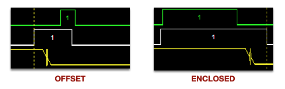
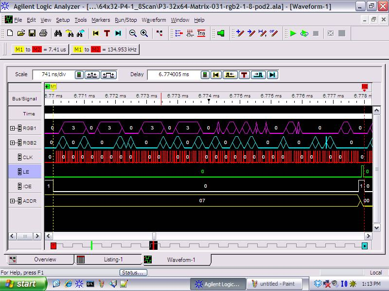

# HUB75 Driver - configuring for a chip we haven't seen yet

![Project Maintenance][maintenance-shield]

## Intent

The P2 HUB75 backend-end driver has configuration values we place in the file: **isp_hub75_hwGeometry.spin2**.  This page presents more detail of what's happening behind the scenes for some of these configurable values.

## Driver Adjustable Settings for given Panel

The driver currently offers the following adjustments:

| Purpose           |  Value Choices |  Description
|-----------------|-------------|-----|
| LATCH_STYLE | OFFSET, ENCLOSED | Adjust the waveform of Latch & OE! |
| LATCH_POSITION | OVERLAPPED  with the Last Bits of the row AFTER the last bits of the row | When should the latch occur relative to the bits for each row? |
| INIT_PANEL | True, [False] | The Driver chips on this panel require/support a configuration stream prior to normal operation (e.g., FM6126A, FM6126Q, FM6127, and MBI5124)
| WIDER_CLOCK | True, [False] | Inject a wait during the high portion of the data clock (ICN2037 Has 20MHz limit)
| RED\_BLUE_SWAP | True, [False] | It seems that our 64x64 panel requires the red and blue lines to be swapped
| SCAN\_4 | True, [False] | By default [False] the driver sends half the panel pixels over the each of the two sets of RGB lines (RGB1,RGB2), A 1/8th scan panel however [True] sends two diff regions of 1/4 of the panel which is a different pixel ordering. 
| ADAPTER\_BASE_PIN | 0-15, 16-31, 32-47, 48-63 [*no default*] | compile driver to use specific header pair to which the HUB75 Adapater card is attached

### PURPOSE: LATCH_STYLE

The driver has two built-in LATCH, OE! styles supporting the hardware we've seen to date.

**FIGURE 1: LATCH_STYLE: OFFSET (left), ENCLOSED (right)**

#### LEGEND

| Signal | Color |
|-----|-----|
| LATCH | Green |
| OE! | White |
| ADDR | Yellow |

In the OFFSET case: we see OE! going high, we see the row address changing and then we see LATCH going high which latches the serial data into the chip. Then we see the OE! going low, followed by the LATCH going low.  However, in the ENCLOSED case the LATCH signal goes low before the OE! goes low.

### PURPOSE: LATCH_POSITION

The driver supoorts two forms of latch position:

**FIGURE 1: LATCH_POSITION: OVERLAPPED (left), AFTER (right)**

#### LEGEND

| Signal | Color |
|-----|-----|
| CLK | Red |
| LATCH | Green |
| OE! | White |
| ADDR | Yellow |

In the OVERLAPPED case: we see LATCH going high before the start of the three last serial bits of the row and ending after the last serial data bit.  However, in the AFTER case we see the LATCH signal going high after the final serial bit of the row is sent.

## Driver configuration by chip type

In this section we are recording the configuration we've shown that works for each of the following driver chips we've seen used in the panels.  As you identify more, please file an issue telling us the settings you found that work with your panels' driver chip. And we'll add the new details to this document for us all to see.

### Driver Chip: FM6126A

This is the most complicated of the driver chips to date. These chips don't turn on reliably until they've been configured which is a process nearly the same as writing a single row of data but with special meaning to the bit stream and special latch timing. This Chip supports faster data CLK (Max 30MHz)

- LATCH_STYLE: OFFSET
- LATCH_POSITION: OVERLAPPED 
- CONFIGURE_PANEL: True
- WIDER_CLOCK: False
- RED_BLUE_SWAP: False
- SCAN_4: False

Signal Waveforms and timings for driver r1.1

|  | Time | Frequency |
|----|----|----|
| Data CLK | 73.6 nSec (avg) | 13.58 mHz |
| Single PWM Row  | 4.87 uSec | 205.44 kHz |
| Single PWM Frame (32 rows) | 91.08 uSec | 10.98 kHz |
| Single Frame (16 pwm frames) | 1.57 mSec | 636.9 fps |
 

#### Single PWM Frame (32 rows) timing (@v0.1):

#### Single PWM Row timing (@v0.1):

---

### Driver Chip: FM6124 (UNKNOWN)

This is the most simple chip form. This chip also supports faster data CLK (Max 30MHz)

- LATCH_STYLE: ENCLOSED
- LATCH_POSITION: AFTER 
- CONFIGURE_PANEL: False
- WIDER_CLOCK: False
- RED_BLUE_SWAP: False
- SCAN_4: False

Signal Waveforms and timings for driver r1.1

|  | Time | Frequency |
|----|----|----|
| Data CLK | 54 nSec (avg) | 18.62 mHz |
| Single PWM Row  | 3.38 uSec | 295.86 kHz |
| Single PWM Frame (32 rows) | 67.18 uSec | 14.88 kHz |
| Single Frame (16 pwm frames) | 1.07 mSec | 930.3 fps |
 

#### Single PWM Frame (32 rows) timing (@v0.1):

#### Single PWM Row timing (@v0.1):

---

### Driver Chip: ICN2037 (UNKNOWN)

This is nearly the same as the FM6124 but needs a slower data CLK (Max 20MHz) (wider pulse width) and our 64x64 panels appear to need Red/Blue swapped!?.

- LATCH_STYLE: ENCLOSED
- LATCH_POSITION: AFTER 
- CONFIGURE_PANEL: False
- WIDER_CLOCK: True
- RED_BLUE_SWAP: True
- SCAN_4: False

Signal Waveforms and timings for driver r1.1 using 64x64 Panel.

|  | Time | Frequency |
|----|----|----|
| Data CLK | 65 nSec (avg) | 15.38 mHz |
| Single PWM Row  | 4.34 uSec | 230.42 kHz |
| Single PWM Frame (64 rows) | 165.31 uSec | 6.05 kHz |
| Single Frame (16 pwm frames) | 2.64 mSec | 378.1 fps |
| SCREEN -> PWM Conversion | 5.505 mSec | 181.65 fps |

#### Single PWM Frame (64 rows) timing (@v0.1):

#### Single PWM Row timing (@v0.1):

---

### Driver Chip: MBI5124_8S (MBI5124 but panel is 1/8 scan)

This is nearly the same as the FM6124 but but halves the number of address lines which is normally panel rows / 2, but in this case is panel rows / 4. It also clocks out 2x the number of pixels per row.  

*NOTE: The MBI5124 does support configuration but it appears that it is already configured at power-up so this driver does not attempt to configure the panel currently. The setting CONFIGURE_PANEL is marked as true so if we add configuration later the driver will use it.*

- LATCH_STYLE: ENCLOSED
- LATCH_POSITION: AFTER 
- CONFIGURE_PANEL: True
- WIDER_CLOCK: False
- RED_BLUE_SWAP: False
- SCAN_4: True

Signal Waveforms and timings for driver r1.1 using 64x32 Panel.

|  | Time | Frequency |
|----|----|----|
| Data CLK | 56.88 nSec (avg) | 17.58 mHz |
| Single PWM Row  | 7.41 uSec | 134.95 kHz |
| Single PWM Frame (8 rows) | 67.07 uSec | 14.91 kHz |
| Single Frame (16 pwm frames) | 1.07 mSec | 931.7 fps |
| SCREEN -> PWM Conversion | 5.505 mSec | 181.65 fps |

*NOTE: while the driver can generate 931 FPS, we are limited by the time it takes to convert a full screen image to pwm frames. This is why the final row in this table shows a frame rate of 181 FPS vs. the 931 FPS.*

#### Single PWM Frame (8 rows, 128 px/row) timing (@v0.1):

#### Single PWM Row timing (@v0.1):

----

### Driver Chip: ICN2037 (UNKNOWN) for P2 P2 Cube

This is nearly the same as the FM6124 but needs a slower data CLK (Max 20MHz) (wider pulse width) and our 64x64 panels need Red/Blue swapped.
**NOTE** However, I'm successfully clocking the panels at 28.6 MHz (which is faster than the panel 20 MHz max.) while clocking the P2 at 335 MHz.

- LATCH_STYLE: ENCLOSED
- LATCH_POSITION: AFTER 
- CONFIGURE_PANEL: False
- WIDER_CLOCK: True
- RED_BLUE_SWAP: True
- SCAN_4: False

Signal Waveforms and timings for driver v0.9 using 64x64 Panel.

| Measured Item | Time | Frequency | Notes  |
|----|----|----|----|
| Data CLK | 35 nSec (avg) | 28.6 mHz | |
| Single PWM Row  | 14.3 uSec | 69.9 kHz | |
| Single PWM Frame (32 rows, 384 px) | 457.8 uSec | 2.18 kHz | |
| Single Frame (16 pwm frames)| ??? mSec | ??? fps | Need to measure this... |
| SCREEN -> PWM Conversion | 33.3 uSec |  | (less than a single PWM Frame)|

#### Single PWM Frame (6 panels, 64 rows) timing (@v0.9):

A single PWM Frame consists of writing 32 - 384 pixel lines (which paint to the top 32 and bottom 32 rows at the same time.)
In this image this single line starts at Marker M1 (yellow) and ends at Marker M2 (red.)

#### Single PWM Row (6 panels) timing (@v0.9):

When this driver is configured for the P2 P2 Cube (1 chain of 6 64x64 pixel panels) the driver copies two lines of PWM data from Hub RAM to COG RAM, clocks out the two rows then fetches the next 2 rows. Within the driver code these two-row groups are called subFrames. For the 6x64x64 panel-set there are 16 of these subFrames for each PWM Frame. There are 16 PWM Frames creating what we know as a single video frame.  The folloing image shows the clocking out of a single subframe (2 lines) which are in Cog RAM.

If you study the /OE line (output enable bar), in the image above, you can see that every other pulse is wider. This additional width (~715 nS) happens once per subFrame. It is the time it takes to copy our next two rows into COG RAM before they can be displayed.  So to get our best approximation of an individual line rate we half the duration of the two line and double the frequency of the two lines: 28.6 / 2 uSec -> 14.3 uSec and 34.9528 * 2 kHz -> 69.9 kHz. This is how we calucated the values shown in the chart above.

----

If you like my work and/or this has helped you in some way then feel free to help me out for a couple of :coffee:'s or :pizza: slices!

----

## License

Copyright © 2020 Iron Sheep Productions, LLC. All rights reserved. 
Licensed under the MIT License.  
 
Follow these links for more information:

### [Copyright](copyright) | [License](LICENSE)

[maintenance-shield]: https://img.shields.io/badge/maintainer-stephen%40ironsheep.biz-blue.svg?style=for-the-badge

[license-shield]: https://camo.githubusercontent.com/bc04f96d911ea5f6e3b00e44fc0731ea74c8e1e9/68747470733a2f2f696d672e736869656c64732e696f2f6769746875622f6c6963656e73652f69616e74726963682f746578742d646976696465722d726f772e7376673f7374796c653d666f722d7468652d6261646765

[releases-shield]: https://img.shields.io/github/release/ironsheep/p2-LED-Matrix-Driver.svg?style=for-the-badge

[releases]: https://github.com/ironsheep/p2-LED-Matrix-Driver/releases
