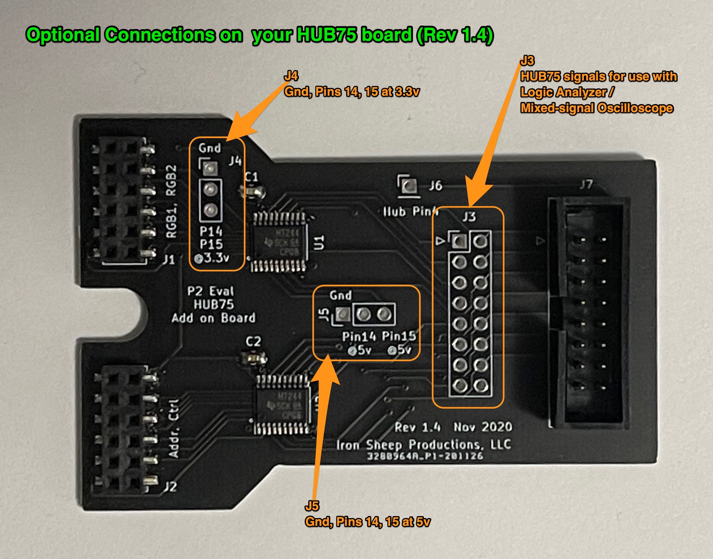

# P2 Eval HUB75 Adaptor Board

![Project Maintenance][maintenance-shield]

## Use of optional connectors (Rev 1.4 black)

The optional connectors allow you to monitor the signals output to the HUB75 connector by the P2 driver and possibly make use of the unused P2 Pins IO+14 and IO+15.  

J4 and J5 allow access to the 2 pins not being used to drive the HUB75 devices, while J3 allows you to fully monitor all signals at the HUB75 connector. Simply connect high-impedance probes to the header pins.

You likely received a small bag of header pins cut specifically so they can be soldered at these locations should you wish to use J3, J4 or J5.



## Use of optional connectors (Rev 1.2 red & 1.3 green)

The optional connectors are the same for the r1.2 and r1.3 boards as r1.4 but do not have the associated ground pins at J4 and J5.


## Connecting your board

The HUB75 adapter board is compatible with both the P2 Eval board and the new P2 Edge Board.  Simply choose a connector-pair then attach the board. Lastly you'll need to configure the driver so it knows which connector-pair to use. See [Driver Configuration Details](THEOPS.md)


## HUB75 Adapter Board Pinout

| P2 Pin | Hub 75 Pin | Description |
| ------- | ------- | ------- |
| **Upper Connector** | | |
| io+15 | J4-1, J5-1 | Unused avail. at J4 at 3.3v or J5 at 5v |
| io+14 | J4-2, J5-2 | Unused avail. at J4 at 3.3v or J5 at 5v |
| io+13 | J3-7, J7-7 | Blue 2 |
| io+12 | J3-6, J7-6 | Green 2 |
| io+11 | J3-5, J7-5 | Red 2 |
| io+10 | J3-3, J7-3 | Blue 1 |
| io+9 | J3-2, J7-2 | Green 1|
| io+8 | J3-1, J7-1 | Red 1 |
| **Lower Connector** | | |
| io+7 | J3-8, J7-8 | Addr E |
| io+6 | J3-12, J7-12 | Addr D |
| io+5 | J3-11, J7-11 | Addr C |
| io+4 | J3-10, J7-10 | Addr B |
| io+3 | J3-9, J7-9 | Addr A |
| io+2 | J3-14, J7-14 | Latch Enable |
| io+1 | J3-15, J7-15 | Output Enable bar |
| io+0 | J3-13, J7-13 | Clock |
| +5v|  | VCC for the two I/Cs |

Here's a simple diagram showing related pin groups:


---

*If you have any questions about what I've written here, file an issue and I'll respond with edits to this doc to attempt to make things more clear.*

Thanks for Reading, following along. I look forward to seeing what displays you come up with. Please let me know when you do!

```
Stephen M. Moraco
Lead developer
Iron Sheep Productions, LLC.
```

If you find this kind of written explanation useful, helpful I would be honored by your helping me out for a couple of :coffee:'s or :pizza: slices!

[](https://www.buymeacoffee.com/ironsheep)

---

Last Updated: 02 Dec 2020, 00:58 MST

[maintenance-shield]: https://img.shields.io/badge/maintainer-stephen%40ironsheep.biz-blue.svg?style=for-the-badge
