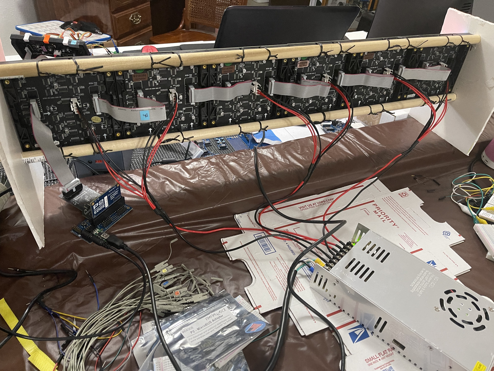

# Hardware Turn-on

## Awakening the HUB75 LED Matrix Driver for Propeller 2

![Project Maintenance][maintenance-shield]

There are many RGB LED matrices available. This drivers is built specifically for **HUB75** driven matrices which are usually found in sizes ranging from 16x16 to 64x64 and ranging in horizontal/vertical spacing form 2mm (P2) to 8mm (P8) between individual LEDs.  The version i'm developing with is actually a P3 64x32 Matrix which I originally bought from Amazon.

These panels are receive serial data, a clock signal indicating when to latch the data bits, a latch signal indicating that a whole rows of data should be sent to the LEDs a set of address lines (A, B, C, and D) idenitfying which row should be displayed and an output-enable signal causing an addressed row LEDs to be driven.

While the 64x32 Matrices all appear to be similar the manufacturing of them has been rapid and varied. For us this means that a HUB75 panel can have very different Integrated Circuits (ICs) on the panel driving the LEDs. With these IC changes comes the need alter the signals sent to the panels so that the ICs your panel uses understands the input signals.

In general i'm finding so far that there are 3 or 4 commmon choices for ICs used on the panels. One GitHub user **Piotr Esden-Tempski**  offers  doc's for some of the panels [esden/led-panel-docs](https://github.com/esden/led-panel-docs) showing images of the panels, schematics and datasheets for the ICs used on the panel. (*I'm planning on contributing my schematic and various finds to his repo as a Pull request before this project is completed.*) There are many more that he does not have but this is a good reference.

### Pages: [README](README.md) | Hardware Turn-on | [Driver Details](THEOPS.md) | [Change Log](ChangeLog.md)

## Bringing up your own display

The path from a new adapter and panels to a working display is five steps. Every demo and test top file named here is in the `driver/` folder.

1. **Attach the adapter.** The [HUB75 adapter board](HUB75Adapter.md) plugs onto a pair of 2x6 accessory headers, one of the three 16-pin groups P0-P15, P16-P31 or P32-P47. Its pins are listed in the [adapter pinout](HUB75-brd-config.md#hub75-adapter-board-pinout).
2. **Check the pins (optional, with a logic analyzer).** `isp_hub75_anlyCheck.spin2` is a standalone top file, not part of the driver: it drives every adapter pin so you can confirm your analyzer connections and the wiring. It takes its pin group from `MTX_LED_BASE_PIN` at the top of the file, not from the driver's configuration, and runs until you stop it. `test_hub75_pin_identify.spin2` toggles each adapter pin at its own known frequency so you can tell which analyzer lead is on which pin.
3. **Describe your hardware.** Edit `isp_hub75_hwPanelConfig.spin2`, the only file you change for a setup. For the adapter's display (`DISP0_` for the first adapter) set the pin group (`DISP0_ADAPTER_BASE_PIN`), the panel chip (`DISP0_PANEL_DRIVER_CHIP`), the address lines (`DISP0_PANEL_ADDR_LINES`), the panel size (`DISP0_MAX_PANEL_COLUMNS`, `DISP0_MAX_PANEL_ROWS`) and the colour depth (`DISP0_COLOR_DEPTH`). Describe where the panels are and how they are cabled with the wiring sentences `DISP0_C0` ... `DISP0_C15`, and how the whole display hangs with `DISP0_ROTATION`. The settings are explained in [Multi-Panel Configuration](DOCs/MultiPanelConfiguration.md), and the sentences in the [Wiring Guide](DOCs/WiringGuide.md). Start with every arrow `ARROW_UP` and `ROT_NONE`.
4. **Run the identify program.** `demo_hub75_numberPanels.spin2` starts the adapter with one call, `display.start(hub75Bffrs.HUB75_ADAPTER_1)`, and draws on every panel an arrow, its cable position (`C`*k*) and its panel position (`P`*p*), each panel on its own background colour. Before the panels start, the driver checks your sentences and prints the layout it derived to the DEBUG terminal; a mistake is named by setting (`DISP0_C2: ...`) and startup stops, with the full list of messages in the [Wiring Guide](DOCs/WiringGuide.md#startup-messages). When the panels read right, the `P` labels run in reading order and every arrow points up. If not, the [Wiring Guide](DOCs/WiringGuide.md#filling-in-your-config-from-the-identify-screen) shows how to read the screen and correct the sentences.
5. **Run the demos.** `demo_hub75_color.spin2`, `demo_hub75_text.spin2`, `demo_hub75_scroll.spin2` and the others show the drawing calls; each sets its own clock and starts the adapter the same way.

A display of six square panels folded into a cube is configured the same way, with the shape and the top and front faces added; see [the cube](DOCs/WiringGuide.md#the-cube).

## My Panel

The panels I'm using are marked with **P3-6432-121-16s-D1.0**  Which tell us that it is 64w x 32h (6432) and 16 addressed lines (16s).  This board uses FM6126A driver chips and TC7258EN chips for line address decoding. Lastly is uses 74HC245s to buffer the incoming signals and forward them to the output conector.  The FM6126A requires that we latch the data very differently in that instead of latching after the stream of bits for a line, we set the latch during the last 3 bits of each line. (per the Datasheet)  Additionally, the FM6126A requires initialization of two registers before it runs as a normal panel. This was quite the discovery as the Chinese Datasheet says the two registers exist but doesn't provide detail. Finding details and implementing the initialization was an effort of blending what I saw in posts which showed various forms of coce and other posts describing their reverse engineering of the same effort. But, it's all working, so I'm past this!

## Development Environment

Here we see my P2 Eval board with flying leads going to a splitter board I hand made so I can feed the panel and watch the signals with a Logic Analyzer.

## Project goals

Overall: Let's see what performance we can achieve by driving from the Propeller 2 directly! 

But let's be more specific:

| Goal               | Sub-goal  | Description |
| ------------------ | --------- | ----------------------------------------------------------------------- |
| Video Frame Rates  | -  | Better than 30fps of gamma corrected 24bit color frames for at least 2x2 64x32 LED panels |
| Understand system demand | -  | Study overall system performance so we know how this will behave with various peripherals and panel configurations |
| - | Use P2 internal ram resources|  Study driver use of COG Registers, LUT RAM, and HUB RAM |
| - | w/P2 Eval HyperRAM  |  Will we need, can we benefit from using HyperRAM / External RAM? |
| - | w/uSD Storage  | What is our performace displaying images / video directly from the P2 uSD card? |
| - | w/Receiving image data from RPi  | Is the RPi SPI interface sufficient to keep our panels streaming video? |
| Reusable Driver | - | Ensure driver can be configured for (1) single panel size, (2) organization of multi-panel chains, and (3) the various panel chip-sets which require different clocking styles (within practical limits: *all panels must use the same chip-set*) |
| long-term | - | Can we drive multiple panel chains - we have 64 GPIO pins on the P2... we should easily be able to connect 3 HUB75 adapters. Can we drive them all at video frame rates?  What is our limitation here? |

**NOTE:** The refresh rates the driver reaches, at every colour depth, are measured on the author's rig and on single panels, and are listed in the [Wiring Guide](DOCs/WiringGuide.md#measured-refresh). The driver aims for the rate you set in `DISPn_TARGET_REFRESH_HZ` (default 60 Hz) and lights the panels as brightly as that rate allows.

----

> If you find this kind of written explanation useful, helpful I would be honored by your helping me out for a couple of :coffee:'s or :pizza: slices -or- you can support my efforts by contributing at my Patreon site!
>
>  &nbsp;&nbsp; -OR- &nbsp;&nbsp; [Patreon.com/IronSheep](https://www.patreon.com/IronSheep?fan_landing=true)

----

### The Eval Adapter Board

Since the project goals are speed related, flying leads are not good enough to get to the higher speeds... so the driver is built around this Eval Adapter board:

On this board you see 3.3v to 5v level shifters. I found that at higher speeds the clock, latch and OEb signals were falling below the signal threshold. This was a great exercise in Logic Analyzer use as I had originally set my input thresholds for 3.3v signals and of course they looked perfectly timed.  When I couldn't get reliable shifting and latching a had the thought that I'm dealing with 5v logic on the panels. Silly me, I had the LA configured for the output logic form, not the panel form of signal. So I switched to 5v threshold and then immediately saw that I was not at all clocking cleanly. quickly interposed the level shifer pcb that I had laying around and all the signals snapped to, as I really needed to see!  I was back in the land of the code I write now drives the signals I expect...  whew!

### 1st Order of HUB75 Adapter Boards arrived!

The boards arrived from JLCPCB! After determing that mechanically they fit Figure (1) below, then I built one up - Figure 2 and then after some power and ground double checks, I connected the new adapter PCB - Figure (3), lastly I connected up the Logic Analyzer flying leads so that I can verify all of the control/data signals to the panel - Figure (4).

It turned on completely. It also scared me at first (*you'll notice that it's on a different connector than my original flying leads test setup.*) This caused my driver to have a few hickups as I was straightening out what the new pins were! 

But, I can't complain. After the driver issues were "sorted" this 1st run of boards turned out to be 100% functional. It's a good feeling!

## P2 Cube Driver Checkout

One of the projects the P2 community is working on is a 6-sided cube of 64x64 panels.  I'm certifying the driver for use on this P2 Cube project. 

The P2 Forum Thread is found here: [P2 P2 Cube](https://forums.parallax.com/discussion/172696/p2-p2-cube/p1) 

And the repository for design and physical objects is found here [Repository: P2 P2 Cube](https://github.com/jshook/p2_p2_cube)

How the driver folds six panels into a cube is in the [Wiring Guide](DOCs/WiringGuide.md#the-cube); more turn-on photos are on the [cube pictures page](CubePix.md).

This is the back of my 6 x 64x64 panel driven with a 5V 60A power supply so we can test full display Brightness. 

This is a snapshot of the 6 x 64x64 panel showing the driver configured for a single panel display - the pic is a shot of an animation taking place. The 1/6th panel to the right contains the correct display the remaing 5 panels to the left are receiving the same data... just one for offset for each further panel to the left.

## Cascaded Panels

Daisy-chained panels make larger images. Here you see these panels waiting to be cabled into one display; how to describe a chain to the driver is in the [Wiring Guide](DOCs/WiringGuide.md), and the configurations the author has run are in [Author Test Configurations](DOCs/AuthorTestConfigurations.md).

## Credits

- I was encouraged by published work by **Rayman** (found on the [Parallax Forums](https://forums.parallax.com/categories/propeller-2-multicore-microcontroller)) where he wrote initial propeller v1 spin/pasm code to demonstrate how to drive his matrix panel. I found [the article](http://www.rayslogic.com/propeller/Programming/AdafruitRGB/AdafruitRGB.htm) linked to from the AdaFruit website.

## License

Licensed under the MIT License.  
 
Follow these links for more information:

### [Copyright](copyright) | [License](LICENSE)

[maintenance-shield]: https://img.shields.io/badge/maintainer-stephen%40ironsheep.biz-blue.svg?style=for-the-badge

[license-shield]: https://img.shields.io/badge/License-MIT-yellow.svg

[releases-shield]: https://img.shields.io/github/release/ironsheep/p2-LED-Matrix-Driver.svg?style=for-the-badge

[releases]: https://github.com/ironsheep/p2-LED-Matrix-Driver/releases
