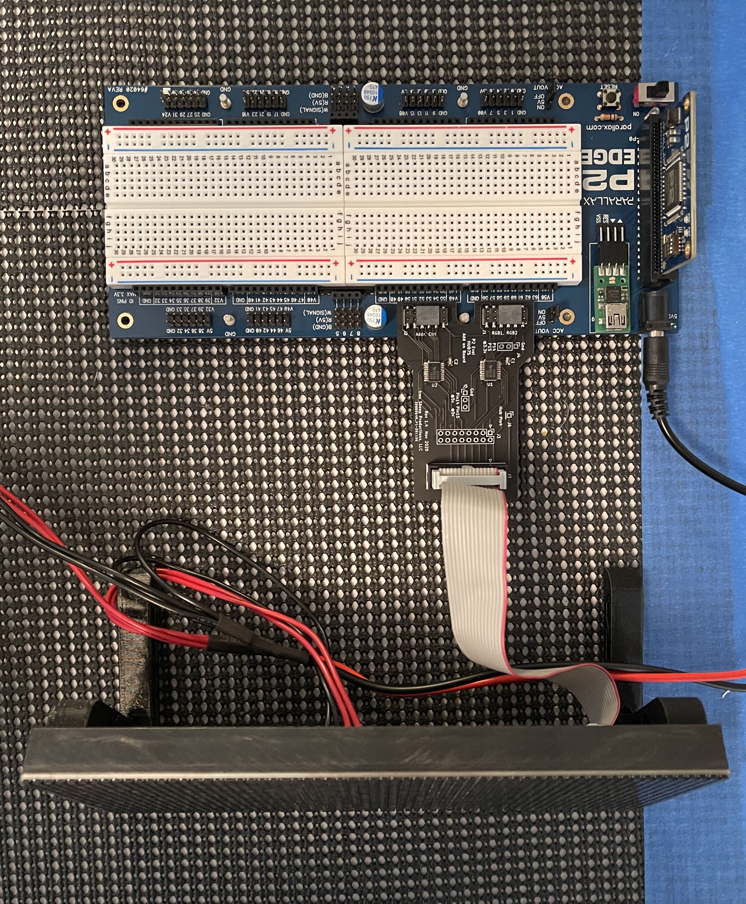

# P2 HUB75 LED Matrix Driver

![Project Maintenance][maintenance-shield]

[![License][license-shield]](LICENSE)

[![GitHub Release][releases-shield]][releases]

**This P2 HUB75 driver is built to work with the P2 Eval HUB75 Adapter which is available from [Parallax.com Store](https://www.parallax.com/product-category/propeller-2/)**

The P2 HUB75 Driver is available from a couple of sources:

- [The P2 Object Exchange](https://github.com/parallaxinc/propeller/tree/master/libraries/community/p2) as "ISP HUB75 Matrix"
- From this repository from the [Releases page](https://github.com/ironsheep/p2-LED-Matrix-Driver/releases)

```
Latest Updates:
10 Nov 2022
- Convert initialization: enable support for up to three hub75 cards!
- Rename demo's, add two more demo's
- Upgrade scrolling, now supports up/down/right/left!
- Added support for New Panel (same chip as ICN2037 but different setttings new name is: **ICN2037_B** - colors are not swapped and scan is different)
07 Apr 2022
- add support for GS6238S 
- add Green/Blue flip support needed by GS6238S
05 Apr 2022
- Converted to new PWM generation mechanism allowing compile-time selection of desired display color depth of 3-bit to 8-bit.
- Now uses 25% of RAM required by previous version for same color bit depth.
- Frees up 300kB RAM on P2 P2 Cube Application
- Latest timing and memory usage info posted.
11 May 2021
- Significant performance upgrade for P2 P2 Cube support (thank you Chip!)
- Released as v0.9.0 (will bump to v1.x when we get multipanel support working for all supported chips)
10 May 2021
- Added first working 6-panel support enabling P2 P2 Cube use.
```

## Table of Contents

This README reflects the current state of the driver as currently released

On this Page:

- [Current Project state](#current-project-state)
- [Pending Development](#pending-development)
- [Driver Setup and Configuration](#driver-setup-and-configuration)
- [Driver Constants used for configuration](#driver-setup-and-configuration)
- [Example Driver Configurations](#example-driver-configurations)
- [Writing display code for your panels](#writing-display-code-for-your-panels)
- [BACKGROUND: ...]() - a couple of project background topics
- [How to Contribute](#how-to-contribute)

Additional pages:

- [HardwareTurnon](HardwareTurnon.md) - Describes the initial turn-on effort of this driver
- [Driver Details](THEOPS.md) - Provides more detail about the driver and driver-configuration
- [Panel Config/Timing Details](HUB75-Driver-SWver1.md) - Notes about each panel-driver chip this P2 driver supports
- [HUB75 Card Details](HUB75-brd-config.md) - Pins and Probing Support provided by HUB75 card
- [P2 P2 Cube testing](CubePix.md) - Author's test hardware - Flat P2 P2 Cube Configuration
- [Change Log](ChangeLog.md) - Notes about each release of this driver


## Current Project state

What's working today with the current driver:

- **5x7 font** is now full upper/lower case plus all control characters found in standard ASCII set
- **5x7 dithered font** - full upper/lower case plus all control characters found in standard ASCII set
- **5x7 dithered font with descenders** - full upper/lower case plus all control characters found in standard ASCII set
- Up to **3 HUB75 cards** supported on a single P2
- Compile-time selectable color depth from 3 to 8-bits per color, per hub75 card
- P2 P2 Cube support (display on all 6 surfaces of cube)
- Single panel support working well for supported chips, up to 8192 leds (128x64)
- Supported Panel Driver Chips: FM6126A, FM6124, ICN2037, ICN2038S, and MBI5124 (1/8 scan)
- Multi-panel support working well for ICN2037 chip only (*we're trying to figure out the panel initialization sequences for chips like the FM6126A. Until we do, Multi-panel won't work for these panels*)
- PWM'ing images to achieve 3-bit to 8-bit color per LED (9-bit to 24-bit color per pixel)
- Displaying text in both 5x7 and 8x8 fonts
- Initial version of scrolling text - will get more performant in future updates (now up, down, right, and left scroll!)
- Basic color pixel placement at row, column (whole panel-set and Single-panel-of-set forms)
- Basic drawing primitives (whole panel-set and Single-panel-of-set forms)
- Loading and displaying images from .bmp files (that are identically sized to your single panel)  *This demonstration is built for 64x32 panels only, any other will require code rework. This is here to demonstrate how it can be done. The rework should be simple work within this example*

**NOTE:** *With every update we post we also update the [ChangeLog](ChangeLog.md). It will have the most up-to-date driver code/feature status.*

## Chips Supported
This driver works with the following chips. Other chips may well work since the adaptation to a chip is selecting various driver settings control signalling to the chip.  Here are the chips we have tested and proven working in Single- or Multi-panel configurations:

| Chip | Address | Max Clk | Status | Manufacturer | Notes
| --- | --- | --- | --- | --- | --- |
| DP5125D | ABC | ?? | working `Multi-panel` | Shenzhen Developer Microelectronics Co., Ltd |
| FM6124 | ABCD | 30 MHz | working `Single-panel` | Shenzhen Funman Electronics Group Co., Ltd. 
| FM6126A | ABCD | 30 MHz | working `Multi-panel` | Shenzhen Funman Electronics Group Co., Ltd. | Requires Panel init sequence to get Multi-panel working!
| GS6238S | ABCD | ?? | working `Single-panel` | ?? | ??
| ICN2037 | ABCDE | 30 MHz | working `Multi-panel` | Chipone Technology (Beijing) Co., Ltd. | Our P2 P2 cube panels 
| ICN2037BP | ABCDE | 30 MHz | working `Multi-panel` |Chipone Technology (Beijing) Co., Ltd. |
| ICN2038S | ABCDE | 30 MHz | working `Multi-panel` | Chipone Technology (Beijing) Co., Ltd. |
| MBI5124GP | ABC | 25 MHz | working `Single-panel` | Macroblock, Inc. (Taiwan) | Requires Panel init sequence to get Multi-panel working! Finally have datasheet, there is hope!

## Pending Development

Upcoming work on the driver:

- Finishing work on initialization of panel chips that require it (MBI5124GP). It's working for single panels but not multiple panels in the chain. *There's a lot of information that is just not readily found on this panels making continuing this "kind of hit-or-miss".*
- Finishing implementation of 2-dimentional panel-set support. Today the driver can handle a single row of multiple panels, but handling N-rows of N-columns of panels needs to be implemented/tested.

## Driver Setup and Configuration

Once you have the driver downloaded and the source files added to your project you will first need to configure the driver by adjusting the constants which describe the configuration of your panel(s) in the files: **isp\_hub75_hwPanelConfig.spin2** and enabling a 2nd and even a 3rd hub75 adapter in  **isp\_hub75_hwBufferAccess.spin2** and **isp\_hub75_hwBuffers.spin2** if you are using more than one hub75 adapter (3 are supported on a single P2).  The first hub75 adapter is already enabled in these files.


### Updating from v1.x?

Conversion from v1.x to v2.x is a small bit of work but you'll be done in minutes. For help, refer to [Update to v2.0 Checklist](Checklist-v1-v2.md).

### Updating from v2.x?

Conversion from v2.x to v3.x is a small bit of work but you'll be done in minutes. For help, refer to [Update to v3.0 Checklist](Checklist-v2-v3.md).

### Driver Constants used for configuration

A quick overview of files to adjust to your hardware:

| Filename | use | what's needing adjustment |
| --- | --- | --- |
| isp\_hub75_hwPanelConfig.spin2 | Inform driver of panel geometry, type and connection for each hub75 adapter | There is a live section for each of three adapters. For any adapters you will use, adjust adapter location, chip type, address lines, panel size, panel arrangement, color depth, and rotation
| isp\_hub75_hwBufferAccess.spin2 | Allocate small tables describing the panel geometries attached to your adapters | 3 entries need to be uncommented for each of the 2nd adapter and 3rd adapters
| isp\_hub75_hwBuffers.spin2 | Allocate large buffers matching your panel geometries attached to your adapters | 3 entries need to be uncommented for each of the 2nd adapter and 3rd adapters


Definition of the constants specified in the file **isp\_hub75_hwPanelConfig.spin2**:

| Name            | Default | Description |
|-----------------|-------------|-------------|
| `DISPx_ADAPTER_BASE_PIN` | {none}  |  Identify which pin-group your HUB75 board is connected |
| `DISPx_PANEL_DRIVER_CHIP` | CHIP_UNKNOWN | in most cases UNKNOWN will work. Some specialized panels need a specific driver chip (e.g., those using the FM6126A, ICN2037, MBI5124\_8S, etc.) |
| `DISPx_PANEL_ADDR_LINES` | {none} | The number of Address lines driving your panels (ADDR\_ABC, ADDR\_ABCD, or ADDR\_ABCDE) |
| `DISPx_MAX_PANEL_COLUMNS` | {none} | The number of LEDs in each row of your panel ( # pixels-wide) |
| `DISPx_MAX_PANEL_ROWS` | {none} | The number of LEDs in each column of your panel ( # pixels-high) |
| `DISPx_MAX_PANELS_PER_ROW` | {none} | The number of panels in each ROW of your display |
| `DISPx_MAX_PANELS_PER_COLUMN` | {none} | The number of panels in each COLUMN of your display |
| `DISPx_COLOR_DEPTH` | {none} | The color depth you wish to display on your panels (compile-time selectable from 3-bit to 8-bit) |
| `DISPx_ROTATION` | {none} | You can rotate the display by setting this value. ROT\_NONE and ROT\_180 works on all panels, while ROT\_LEFT\_90 and ROT\_RIGHT\_90 work best on square displays |

**NOTE**: the DISPx_ is a place holder for DISP0\_\*, DISP1\_\* and DISP2\_\* constants indicating the 1st, 2nd, and 3rd HUB75 cards.

**NOTE**: All the **demo** files use the DISP0_* constants in the above file, meaning they all use the 1st HUB75 adapter.

**NOTE:** as you get into Multi-panel display organizations please pay careful attention to `DISPx_MAX_PANELS_PER_ROW` and `DISPx_MAX_PANELS_PER_COLUMN`.

The file **isp\_hub75_hwBufferAccess.spin2** is where you customize in-memory table entries, one for each hub75 card you wish to activate. One entry is activated by default. You have to uncomment the code for the 2nd and 3rd HUB75 adapters if you wish to use them.

The file **isp\_hub75_hwBuffers.spin2** is where you customize in-memory large buffers, one for each hub75 card you wish to activate. One entry is activated by default.  You have to uncomment the code for the 2nd and 3rd HUB75 adapters if you wish to use them.


Once these values are set correctly, according to your own hardware set up, then you should be able to compile your code and run.  


More detail can be found in [Driver Introduction & Configuration](THEOPS.md)


### Example Driver Configurations

Now let's look at examples as would be specified in the panel configuration file. Here's an example of file content for a **single panel**:

(Within the file **isp\_hub75_hwPanelConfig.spin2**)

```python
    ' /-------------------------------------------
    ' |  User configure

    ' (1) describe the panel connections, addressing and chips
    DISP0_ADAPTER_BASE_PIN = hwEnum.PINS_P16_P31
    DISP0_PANEL_DRIVER_CHIP = hwEnum.CHIP_FM6126A
    DISP0_PANEL_ADDR_LINES = hwEnum.ADDR_ABCD

    ' (2) describe the single panel physical size
    DISP0_MAX_PANEL_COLUMNS = 64
    DISP0_MAX_PANEL_ROWS = 32

    ' the organization of the panels: visual layout
    '   [1]      1 row of 1 panel
    '
    DISP0_MAX_PANELS_PER_ROW = 1
    DISP0_MAX_PANELS_PER_COLUMN = 1

    ' (3) describe the color depth you want to support [3-8] bits per LED
    '    NOTE full 24bit color is hwEnum.DEPTH_8BIT
    '    NOTE: 3-5 bit depth is 2 bytes per pixel, while 6-8 bit depth is 3 bytes per pixel
    DISP0_COLOR_DEPTH = hwEnum.DEPTH_5BIT

    ' (4) Apply desired rotation to entire display
    DISP0_ROTATION = hwEnum.ROT_NONE

    ' |  End User configure
    ' \-------------------------------------------
```

Here's an example for **twin 64x32 panels**:

(Within the file **isp\_hub75_hwPanelConfig.spin2**)

```python
    ' /-------------------------------------------
    ' |  User configure

    ' (1) describe the panel connections, addressing and chips
    DISP2_ADAPTER_BASE_PIN = hwEnum.PINS_P16_P31
    DISP2_PANEL_DRIVER_CHIP = hwEnum.FM6126A
    DISP2_PANEL_ADDR_LINES = hwEnum.ADDR_ABCD

    ' (2) describe the single panel physical size
    DISP2_MAX_PANEL_COLUMNS = 64
    DISP2_MAX_PANEL_ROWS = 32

    ' the organization of the panels: visual layout
    '   [1]       2 rows of 1 panel, ea. (a 64x64 display)
    '   [1]      
    '
    DISP2_MAX_PANELS_PER_ROW = 1
    DISP2_MAX_PANELS_PER_COLUMN = 2

    ' (3) describe the color depth you want to support [3-8] bits per LED
    '    NOTE full 24bit color is hwEnum.DEPTH_8BIT
    '    NOTE: 3-5 bit depth is 2 bytes per pixel, while 6-8 bit depth is 3 bytes per pixel
    DISP2_COLOR_DEPTH = hwEnum.DEPTH_6BIT

    ' (4) Apply desired rotation to entire display
    DISP2_ROTATION = hwEnum.ROT_180

    ' |  End User configure
    ' \-------------------------------------------
```

Here's an example for **P2 P2 Cube: 6 - 64x64 panels**:

(Within the file **isp\_hub75_hwPanelConfig.spin2**)

```python
    ' /-------------------------------------------
    ' |  User configure

    ' (1) describe the panel connections, addressing and chips
    DISP0_ADAPTER_BASE_PIN = hwEnum.PINS_P16_P31
    DISP0_PANEL_DRIVER_CHIP = hwEnum.CHIP_ICN2037
    DISP0_PANEL_ADDR_LINES = hwEnum.ADDR_ABCDE

    ' (2) describe the single panel physical size
    DISP0_MAX_PANEL_COLUMNS = 64
    DISP0_MAX_PANEL_ROWS = 64

    ' the organization of the panels: visual layout
    '   [6]      1 row of 6 panels (yes, but we wrapped them into a cube with 6 sides)
    '
    DISP0_MAX_PANELS_PER_ROW = 6
    DISP0_MAX_PANELS_PER_COLUMN = 1

    ' (3) describe the color depth you want to support [3-8] bits per LED
    '    NOTE full 24bit color is hwEnum.DEPTH_8BIT
    '    NOTE: 3-5 bit depth is 2 bytes per pixel, while 6-8 bit depth is 3 bytes per pixel
    DISP0_COLOR_DEPTH = hwEnum.DEPTH_5BIT

    ' (4) Apply desired rotation to entire display
    DISP0_ROTATION = hwEnum.ROT_NONE

    ' |  End User configure
    ' \-------------------------------------------
```


## Writing display code for your panels

As soon are you are configured you will want to make pixels light up on your panel(s)!

There are a couple of demos which you can review then copy and paste from.  These are:

| DEMO Program    |  Purpose |
|-----------------|-------------|
| demo\_hub75_color.spin2 | Presents the color features of the panel driver, displays a .bmp file |
| demo\_hub75_text.spin2 | Presents the text and scrolling features of the panel driver |
| demo\_hub75_7seg.spin2 | Presents a technique for doing multi-step animations using the panel driver |
| demo\_hub75_multiPanel.spin2 | Presents techniques for drawing to the various surfaces of our P2 P2 Cube |
 demo\_hub75_5x7font.spin2 | Present pages (every 10 sec) showing the latest 5x7 full character-set font |
| demo\_hub75_scroll.spin2 | Shows off the 4 supported text-scrolling directions (albeit slowly ;-)
| demo\_hub75_colorPad.spin2 | **TEST** Simple single-screen demo so you can check if Red Green Blue LEDs are set correctly. (*color patch will match color name underneath if settings for color-swap are correct*) |


**NOTE1:** most of the demo's are built for a 64x32 panels. You may have to modify them to run on your panel geometry.

Once you have a sense for what these demo's do and how they do it, writing your own display code should be fairly easy and initially may even be a copy-n-paste effort from the demo source to your own display code.

**NOTE2** If you are looking for an example of starting up more than one HUB75 cards please refer to the "Starting up two HUB75 cards" example found in the [Update to v3.0 Checklist](Checklist-v2-v3.md).


Please enjoy and let me know if there are features you want to see in this driver!


## BACKGROUND: HUB75 RGB LED Matrix Panels

There are many RGB LED matrices available. This driver is built specifically for **HUB75** driven matrices which are usually found in sizes ranging from 16x16 to 64x64 and ranging in horizontal/vertical spacing form 1.5mm (P1.5) to 8mm (P8) between individual LEDs.  The version I'm developing with is actually a P3 64x32 Matrix which I originally bought from Amazon. The specific ones I'm using are no longer avail. but the are many others.  

Example 32x64 panels:

- [Sparkfun 64x32 P4](https://www.sparkfun.com/products/14718) 
- [Adafruit 64x32 P3](https://www.adafruit.com/product/2279)
- [Adafruit - flexible 64x32 P4](https://www.adafruit.com/product/3826)
- [Amazon - flexible 64x32 P4](https://www.amazon.com/Digital-Flexible-Special-P4-256x128mm-RGB-Full/dp/B07F87CM6Y)
- [Amazon 64x32 P5](https://www.amazon.com/Pixels-Indoor-SMD2121-320x160mm-320160mm/dp/B07SDMWX9R)
- [Amazon 64x32 P4](https://www.amazon.com/NovaeLED-Display-100000hrs-Bright-Colored-Picture/dp/B07LFJD5GY) good price for two identical panels

These panels expect to receive six lines of serial color data, a clock signal indicating when to latch the color data, a latch signal indicating that a whole rows of color data should be sent to the LEDs,a set of address lines (A, B, C, and D) identifying which row should be displayed and an output-enable signal causing an addressed row of LEDs to be driven.

While the 64x32 Matrices all appear to be similar the manufacturing of them has been rapid and varied. For us this means that a HUB75 panel can have very different Integrated Circuits (ICs) on the panel driving the LEDs. With these IC changes comes the need alter the signals sent to the panels so that the ICs your panel uses understands the input signals.

In general i'm finding so far that there are 3 or 4 commmon choices for ICs used on the panels. One GitHub user **Piotr Esden-Tempski**  offers  doc's for some of the panels [esden/led-panel-docs](https://github.com/esden/led-panel-docs) showing images of the panels, schematics and datasheets for the ICs used on the panel. (*I'm planning on contributing my schematic and various finds to his repo as a Pull request before this project is completed.*) There are many more that he does not have but this is a good reference.


**Example Panels** backside of 64x32 p3 and 64x64 p2 panels with cables for power and data.

## BACKGROUND: Driving the panels with our P2

Hooking up our string of panels to the P2 Eval board or the P2 Edge Module Breadboard (*AKA the JonnyMac board*) is quite easy. We will have a **P2 Eval HUB75 Adapter board** for sale at Parallax.com.  It is hooked up as shown in this image:



## BACKGROUND: Project goals

Overall: Let's see what performance we can achieve by driving from the Propeller 2 directly! 

But let's be more specific:

| Goal               | Sub-goal  | Description |
| ------------------ | --------- | ----------------------------------------------------------------------- |
| Video Frame Rates  | -  | Better than 30fps of color corrected 24bit color frames for at least 2x2 64x32 LED panels |
| Understand system demand | -  | Study overall system performance so we know how this will behave with various peripherals and panel configurations |
| - | Use P2 internal ram resources|  Study driver use of COG Registers, LUT RAM, and HUB RAM |
| - | w/P2 Eval HyperRAM  |  Will we need, can we benefit from, using HyperRAM / External RAM? |
| - | w/uSD Storage  | What is our performace displaying images / video directly from the P2 uSD card? |
| - | w/Receiving image data from RPi  | Is the RPi SPI interface sufficient to keep our panels streaming video? |
| Reusable Driver | - | Ensure driver can be configured for (1) single panel size, (2) organization of Multi-panel chains, and (3) the various panel chip-sets which require different clocking styles (within practical limits: *all panels must use the same chip-set*) |
| long-term | - | Can we drive multiple panel chains - we have 64 GPIO pins on the P2... we should easily be able to connect 3 HUB75 adapters. Can we drive them all at video frame rates?  What is our limitation here? |

**NOTE:** Initial turn-on of the pasm2 driver code (1st draft reasonably performant code, not the fastest possible) shows that I'm getting a 1000fps rate with 3 bit color.  This will be derated by PWM especially as we get a much better PWM in place more usefully handling brightness control.

Remember, this is without yet tuning the driver for best performance based on what the chip can do.  Based on the limits of the panel chipset, for the panels on this project, I should be able to drive the panel itself faster than I am in the 1st draft code.  So, there's room to get better here.

----

> If you like my work and/or this has helped you in some way then feel free to help me out for a couple of :coffee:'s or :pizza: slices -or- you can support my efforts by contributing at my Patreon site!
>
> [](https://www.buymeacoffee.com/ironsheep) &nbsp;&nbsp; -OR- &nbsp;&nbsp; [](https://www.patreon.com/IronSheep?fan_landing=true)[Patreon.com/IronSheep](https://www.patreon.com/IronSheep?fan_landing=true)

----

## How to Contribute

This is a project supporting our P2 Development Community. Please feel free to contribute to this project. You can contribute in the following ways:

- File **Feature Requests** or **Issues** (describing things you are seeing while using our code) at the [Project Issue Tracking Page](https://github.com/ironsheep/P2-HUB75-LED-Matrix-Driver/issues)
- Fork this repo and then add your code to it. Finally, create a Pull Request to contribute your code back to this repository for inclusion with the projects code. See [CONTRIBUTING](CONTRIBUTING.md)

----

## Credits

- I was encouraged by published work by **Rayman** (found on the [Parallax Forums](https://forums.parallax.com/categories/propeller-2-multicore-microcontroller)) where he wrote initial propeller v1 spin/pasm code to demonstrate how to drive his matrix panel. I found [the article](http://www.rayslogic.com/propeller/Programming/AdafruitRGB/AdafruitRGB.htm) linked to from the AdaFruit website.

## Disclaimer and Legal

> *Parallax, Propeller Spin, and the Parallax and Propeller Hat logos* are trademarks of Parallax Inc., dba Parallax Semiconductor

---

## License

Copyright © 2020 Iron Sheep Productions, LLC. All rights reserved.<br />
Licensed under the MIT License. <br>
<br>
Follow these links for more information:

### [Copyright](copyright) | [License](LICENSE)

[maintenance-shield]: https://img.shields.io/badge/maintainer-stephen%40ironsheep.biz-blue.svg?style=for-the-badge

[license-shield]: https://camo.githubusercontent.com/bc04f96d911ea5f6e3b00e44fc0731ea74c8e1e9/68747470733a2f2f696d672e736869656c64732e696f2f6769746875622f6c6963656e73652f69616e74726963682f746578742d646976696465722d726f772e7376673f7374796c653d666f722d7468652d6261646765

[releases-shield]: https://img.shields.io/github/release/ironsheep/p2-LED-Matrix-Driver.svg?style=for-the-badge

[releases]: https://github.com/ironsheep/P2-HUB75-LED-Matrix-Driver/releases
