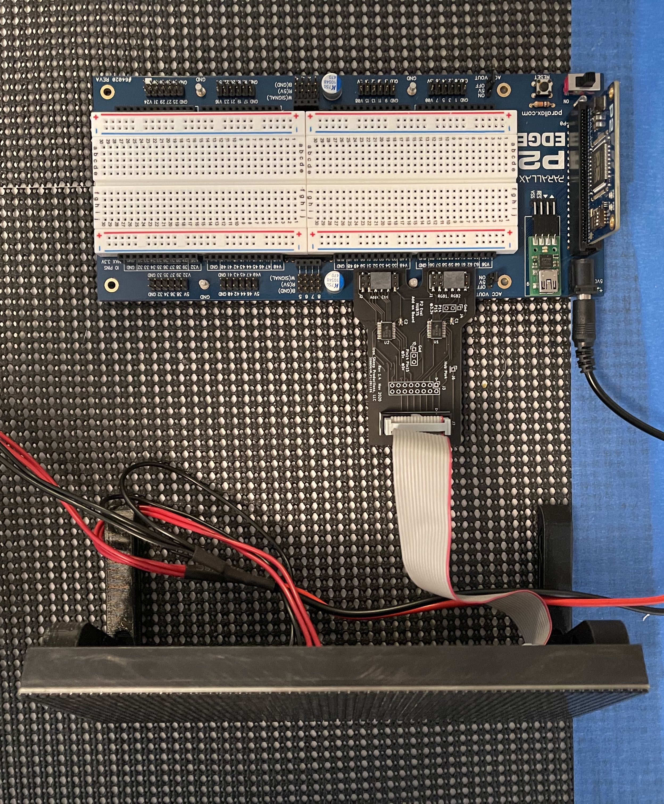

# P2 HUB75 LED Matrix Driver

![Project Maintenance][maintenance-shield]

[![License][license-shield]](LICENSE)

[![GitHub Release][releases-shield]][releases]

**This P2 HUB75 driver is built to work with the P2 Eval HUB75 Adapter which is available from [Parallax.com Store](https://www.parallax.com/product-category/propeller-2/)**

The P2 HUB75 Driver is available from a couple of sources:

- [The P2 Object Exchange](https://github.com/parallaxinc/propeller/tree/master/libraries/community/p2) as "ISP HUB75 Matrix"
- From this repository from the [Releases page](https://github.com/ironsheep/p2-LED-Matrix-Driver/releases)

```
Latest Updates:
Oct 2026 (v4.0.0 - BREAKING: the panel-layout settings and the startup call changed)
- Describe your panels' layout, cabling and mounting with one short sentence per panel (replaces the panels-per-row/column, wire-entry/traversal and per-panel rotation settings)
- Cube display: six panels draw as one object, with lines, boxes, circles, text and scrolling carrying across every edge
- Identify routine labels every panel so you can check your sentences
- A second or third HUB75 adapter no longer needs any driver file edited; one start call per adapter
- Panel-count limits per panel type, with measured refresh rates for the author's rig
- Refresh: each bit plane is shown once and lit by /OE time, to a target refresh rate you set with `DISPx_TARGET_REFRESH_HZ` (default 60 Hz). The author's four-panel rig refreshes at 71.0 Hz at 8-bit
- 8-bit color is the default depth; brightness is /OE time, so the image keeps its full depth at any brightness
- A commit never shows a half-converted image, and `display.showFrameSet()` shows a frame set you built yourself
- Commit and drawing are much faster: on the four-panel rig at 8-bit a commit takes 4.09 ms (from 21.25 ms) and a full-screen fill draws in 4.7 ms (from 635.4 ms). Every drawing call now finds its pixels from a table built at startup and writes them in PASM
- Scrolling and animation keep up with the refresh: a scroll step moves the last frame and draws only the new edge, so one full-width line of text steps in 1.3 ms sideways and 3.3 to 4.1 ms up or down
- Two MBI5124GP panels chained end to end run as one display: the column clock is held to what one chip can pass to the next, and each chip's configuration register is written at start
- Fixes: multi-panel quarter-scan conversion, more than 9 panels, each display shows its own image, 90/270 degree display rotation, text and panel calls on any wiring, right-aligned and centred padded text, right-scrolling text that clears completely
- Upgrading from v3.x? See the new [Update to v4.0 Checklist](Checklist-v3-v4.md)
15 Jan 2024
- Add support for panels using DP5125D chips
- Add Chips' 5x7 dithered fonts
- ICN2037_B was renamed to ICN2038S
- MBI5124_8S was renamed to MBI5124GP
- Rearranged user configurable files in order to support many more total pixels (now 64k) in a display.
10 Nov 2022
- Convert initialization: enable support for up to three hub75 cards!
- Rename demo's, add two more demo's
- Upgrade scrolling, now supports up/down/right/left!
- Added support for New Panel (same chip as ICN2037 but different setttings new name is: **ICN2037_B** - colors are not swapped and scan is different)
07 Apr 2022
- add support for GS6238S 
- add Green/Blue flip support needed by GS6238S
05 Apr 2022
- Converted to new PWM generation mechanism allowing compile-time selection of desired display color depth of 3-bit to 8-bit.
- Now uses 25% of RAM required by previous version for same color bit depth.
- Frees up 300kB RAM on P2 P2 Cube Application
- Latest timing and memory usage info posted.
11 May 2021
- Significant performance upgrade for P2 P2 Cube support (thank you Chip!)
- Released as v0.9.0 (will bump to v1.x when we get multipanel support working for all supported chips)
10 May 2021
- Added first working 6-panel support enabling P2 P2 Cube use.
```

## Table of Contents

This README reflects the current state of the driver as currently released

On this Page:

- [Current Project state](#current-project-state)
- [Pending Development](#pending-development)
- [Driver Setup and Configuration](#driver-setup-and-configuration)
- [Chips Supported](#chips-supported)
- [Driver Constants used for configuration](#driver-constants-used-for-configuration)
- [Example Driver Configurations](#example-driver-configurations)
- [Writing display code for your panels](#writing-display-code-for-your-panels)
- [BACKGROUND: HUB75 RGB LED Matrix Panels](#background-hub75-rgb-led-matrix-panels) - and a couple of other project background topics
- [How to Contribute](#how-to-contribute)

Additional pages:

- [HardwareTurnon](HardwareTurnon.md) - Describes the initial turn-on effort of this driver
- [Driver Details](THEOPS.md) - Provides more detail about the driver and driver-configuration
- [Wiring Guide](DOCs/WiringGuide.md) - How to describe your panels' layout, cabling and rotation, with seven worked examples
- [Chip Characteristics Matrix](DOCs/ChipCharacteristicsMatrix.md) - Notes about each panel-driver chip this P2 driver supports
- [Panel Config/Timing Details (history)](HUB75-Driver-SWver1.md) - The v3-era notes on panel configuration and timing; kept as history
- [HUB75 Card Details](HUB75-brd-config.md) - Pins and Probing Support provided by HUB75 card
- [P2 P2 Cube testing](CubePix.md) - Author's test hardware - Flat P2 P2 Cube Configuration
- [Change Log](ChangeLog.md) - Notes about each release of this driver


## Current Project state

What's working today with the current driver:

- **5x7 font** is full upper/lower case plus all control characters found in standard ASCII set
- **5x7 dithered font** - full upper/lower case plus all control characters found in standard ASCII set
- **5x7 dithered font with descenders** - full upper/lower case plus all control characters found in standard ASCII set
- Up to **3 HUB75 cards** supported on a single P2, each started with one call and no driver-file edits
- Compile-time selectable color depth from 3 to 8-bits per color, per hub75 card
- **Cube display**: six square panels wired as a cube net draw as one object. Face-centric calls (`drawFace*`, `scrollFaceTextAtRC*`) draw lines, boxes, circles, text and scrolling that carry across all 12 edges. *The cube's drawing is proven by a 163-case self-test (`test_hub75_cube_fold.spin2`); it has not yet been run on six real panels.*
- Single panel support working well for supported chips, up to 8192 leds (128x64)
- Supported Panel Driver Chips: DP5125D, FM6124, FM6126A, GS6238S, ICN2037, ICN2037BP, ICN2038S, and MBI5124GP (1/8 scan); see the [chip table](#chips-supported) for the status of each
- Multi-panel status differs by chip: the [chip table](#chips-supported) marks each chip `Multi-panel` or `Single-panel`
- PWM'ing images to achieve 3-bit to 8-bit color per LED (9-bit to 24-bit color per pixel)
- Displaying text in both 5x7 and 8x8 fonts
- Scrolling text in four directions (up, down, right, and left). A step moves the last frame one place and draws only the new edge, so a full-width line steps in 1.3 ms sideways and 3.3 to 4.1 ms up or down on the author's four-panel rig
- Fast drawing: every drawing call (pixels, lines, boxes, fills, circles, text, scrolling, BMP) takes its pixel addresses from a table built when the adapter starts and writes straight runs in PASM. Measured on the four-panel rig at 8-bit: full-screen fill 4.7 ms, fanned lines 13.0 ms, lines of text 24.6 ms, a 64x32 BMP 3.8 ms
- **Wiring sentences**: panel grids of any shape you can cable (a row, a 2x2 in Z or serpentine order, 3x2, an L shape, ...) are described by one short sentence per panel, with each panel's own up (its arrow). The driver checks the sentences at startup and names any mistake. See the [Wiring Guide](DOCs/WiringGuide.md)
- **Identify screen** (`demo_hub75_numberPanels.spin2`) labels each panel with its cable position and its place in the display, so you can fill in and confirm your sentences
- **Display mounting**: say how the whole display hangs (`ROT_NONE`, `ROT_RIGHT_90`, `ROT_LEFT_90`, `ROT_180`) and the driver draws so the content reads upright, with width and height swapped for the sideways mountings
- Clock-frequency-independent panel timing (signal timing derived from `_clkfreq`)
- Basic color pixel placement at row, column (whole panel-set and Single-panel-of-set forms)
- Basic drawing primitives (whole panel-set and Single-panel-of-set forms): panel-centric calls clip at the panel's edge; text and scrolling cross panel seams whole
- Loading and displaying images from .bmp files, of any size, optionally turned by a content rotation (`placeBMP`). *The demonstration is built for 64x32 panels, any other will require code rework. This is here to demonstrate how it can be done.*
- Refresh to a target rate, set per display with `DISPx_TARGET_REFRESH_HZ` (default 60 Hz): the driver lights each bit plane once, weighted by /OE time, and picks the brightest timing that reaches the target. Measured on the author's rig of four ICN2037 128x64 panels: 71.0 Hz at 8-bit, 84.7 Hz at 5-bit, 193.3 Hz at 3-bit. See [refresh rate](DOCs/WiringGuide.md#refresh-rate)
- Brightness (`setBrightness`, 0 to 256) is /OE time: full color depth at any brightness, down to the chip's shortest /OE pulse
- Tear-free commits: a commit converts into the PWM frame set that is not on display, and `display.showFrameSet()` shows a frame set you built yourself
- Panel-count limits per panel type, calculated, plus measured refresh rates for the author's rig: see the [driver limits](DOCs/WiringGuide.md#driver-limits)

**NOTE:** *With every update we post we also update the [ChangeLog](ChangeLog.md). It will have the most up-to-date driver code/feature status.*

## Chips Supported
This driver works with the following chips. Other chips may well work since the adaptation to a chip is selecting various driver settings control signalling to the chip.  Here are the chips we have tested and proven working in Single- or Multi-panel configurations:

| Chip | Address | Status | Manufacturer | Notes
| --- | --- | --- | --- | --- |
| DP5125D | ABC | working `Multi-panel` | Shenzhen Developer Microelectronics Co., Ltd |
| FM6124 | ABCD | working `Single-panel` | Shenzhen Funman Electronics Group Co., Ltd. 
| FM6126A | ABCD | working `Multi-panel` | Shenzhen Funman Electronics Group Co., Ltd. | The driver sends the panel init sequence at start
| GS6238S | ABCD | working `Single-panel` | ?? | ??
| ICN2037 | ABCDE | working `Multi-panel` | Chipone Technology (Beijing) Co., Ltd. | Our P2 P2 cube panels 
| ICN2037BP | ABCDE | working `Multi-panel` |Chipone Technology (Beijing) Co., Ltd. | Same chip as the ICN2037 in another package: configure it as `CHIP_ICN2037`
| ICN2038S | ABCDE | working `Single-panel` | Chipone Technology (Beijing) Co., Ltd. | Single-ended road-sign panel: no daisy-chain by construction |
| MBI5124GP | ABC | working `Multi-panel` | Macroblock, Inc. (Taiwan) | The driver writes each chip's configuration register at start; two panels chained end to end run as one 128x32 display

Each chip's datasheet clock and /OE ratings are in the [Chip Characteristics Matrix](DOCs/ChipCharacteristicsMatrix.md#datasheet-clock-and-oe-ratings).

## Pending Development

Upcoming work on the driver:

- Proving the 4.0.0 display organization on more hardware: the cube on six real panels, more than two MBI5124GP quarter-scan panels in a chain, a second adapter cabled at the same time, panel types not yet run (ICN2037 64x64, FM6124C, ICN2038S, GS6238S, DP5125D) and measured refresh for them. See the Known Issues in the [Change Log](ChangeLog.md).
- I've even some fun animated clocks coming (sorry, I'm been doing software clocks of many, many, forms for a long time.)

Morphing digits Matrix displays can be found at [P2 LED-Matrix Morphing Digits](https://github.com/ironsheep/P2-LED-Matrix-Morphing-Digits) Repository.

## Driver Setup and Configuration

Once you have the driver downloaded and the source files added to your project you configure the driver by adjusting the constants which describe your panel(s) in one file: **isp\_hub75_hwPanelConfig.spin2**. It has a group of settings for each of the three hub75 adapters the driver supports on a single P2; a group left with `NO_PANEL` everywhere costs no memory. No other driver file is edited per setup, and nothing is commented in or out to add a second or third adapter.

Your program then starts each adapter it uses with one call, for example `display.start(display.HUB75_ADAPTER_1)`. Adapter *k* drives the display configured by the `DISP(k-1)_` settings (see the [glossary](THEOPS.md#glossary)).

### Updating from v3.x?

Conversion from v3.x to v4.x changes how your panel layout is described and how the driver is started. For help, refer to [Update to v4.0 Checklist](Checklist-v3-v4.md).

### Updating from v1.x?

Conversion from v1.x to v2.x is a small bit of work but you'll be done in minutes. For help, refer to [Update to v2.0 Checklist](Checklist-v1-v2.md).

### Updating from v2.x?

Conversion from v2.x to v3.x is a small bit of work but you'll be done in minutes. For help, refer to [Update to v3.0 Checklist](Checklist-v2-v3.md).

### Driver Constants used for configuration

The one file to adjust to your hardware:

| Filename | use | what's needing adjustment |
| --- | --- | --- |
| isp\_hub75_hwPanelConfig.spin2 | Inform driver of panel geometry, type, wiring and mounting for each hub75 adapter | There is a live section for each of three adapters. For any adapters you will use, adjust adapter location, chip type, address lines, panel size, color depth, mounting rotation, and the wiring sentences (one per panel)

The files **isp\_hub75_hwBufferAccess.spin2** and **isp\_hub75_hwBuffers.spin2** are no longer edited for your setup: all three adapters are always present, sized from the panels you describe in **isp\_hub75_hwPanelConfig.spin2**.


Definition of the constants specified in the file **isp\_hub75_hwPanelConfig.spin2**:

| Name            | Default | Description |
|-----------------|-------------|-------------|
| `DISPx_ADAPTER_BASE_PIN` | {none}  |  Identify which pin-group your HUB75 board is connected |
| `DISPx_PANEL_DRIVER_CHIP` | CHIP_UNKNOWN | in most cases UNKNOWN will work. Some specialized panels need a specific driver chip (e.g., those using the FM6126A, ICN2037, MBI5124GP, etc.) |
| `DISPx_PANEL_ADDR_LINES` | {none} | The number of Address lines driving your panels (ADDR\_ABC, ADDR\_ABCD, or ADDR\_ABCDE) |
| `DISPx_MAX_PANEL_COLUMNS` | {none} | The number of LEDs in each row of your panel ( # pixels-wide); must be a multiple of 4, or startup stops with a message |
| `DISPx_MAX_PANEL_ROWS` | {none} | The number of LEDs in each column of your panel ( # pixels-high) |
| `DISPx_COLOR_DEPTH` | `DEPTH_8BIT` | The color depth you wish to display on your panels (compile-time selectable from 3-bit to 8-bit; 8-bit is full 24-bit color) |
| `DISPx_TARGET_REFRESH_HZ` | 60 | The refresh rate to aim for, in Hz. The driver picks the brightest panel timing that reaches it. A long chain at deep color may not reach it; the driver then runs at the fastest rate it can and prints that rate at startup. Lower it for more brightness on a large display. How it works and what it reaches: [refresh rate](DOCs/WiringGuide.md#refresh-rate) |
| `DISPx_ROTATION` | ROT\_NONE | How the whole assembled display is **mounted** (physical): `ROT_NONE`, `ROT_RIGHT_90` (hung turned 90 degrees clockwise), `ROT_LEFT_90` (counter-clockwise) or `ROT_180` (upside down). The driver draws so content reads upright as mounted; at 90 and 270 degrees the display's width and height swap. Does not apply to a cube |
| `DISPx_C0` ... `DISPx_C15` | `NO_PANEL` | The wiring sentences: one per cable position, each saying where that panel sits next to an earlier one and which way its arrow points. `DISPx_C0` is the panel the adapter plugs into, `FIRST_PANEL \| arrow`; unused positions are `NO_PANEL`. The grammar is in the [Wiring Guide](DOCs/WiringGuide.md#the-wiring-sentences) |
| `DISPx_SHAPE` | `SHAPE_FLAT` | `SHAPE_FLAT` for an ordinary display, `SHAPE_CUBE` for six square panels wired as a cube net |
| `DISPx_CUBE_TOP`, `DISPx_CUBE_FRONT` | `NO_PANEL` | Used only with `SHAPE_CUBE`: the cable position (`C0` ... `C5`) of the top face and of the front face. The front face shares an edge with the top face. See [the cube](DOCs/WiringGuide.md#the-cube) |

The number of panels, the display's size and its grid, and where each panel sits are all worked out from the wiring sentences when the adapter starts; you do not set them. The driver prints what it worked out, or names the sentence that is wrong, and stops.

**NOTE**: the DISPx_ is a place holder for DISP0\_\*, DISP1\_\* and DISP2\_\* constants indicating the 1st, 2nd, and 3rd HUB75 cards.

**NOTE**: All the **demo** files use the DISP0_* constants in the above file, meaning they all use the 1st HUB75 adapter.

**NOTE:** the panels in a display must all use the same chip, and one adapter can only drive so many panels: see the [driver limits per panel type](DOCs/WiringGuide.md#driver-limits).

Once these values are set correctly, according to your own hardware set up, then you should be able to compile your code and run. Run the identify screen (`demo_hub75_numberPanels.spin2`) first to confirm your sentences; the [Wiring Guide](DOCs/WiringGuide.md#filling-in-your-config-from-the-identify-screen) explains how to read it.


More detail can be found in [Driver Introduction & Configuration](THEOPS.md)


### Example Driver Configurations

Now let's look at examples as would be specified in the panel configuration file. Here's an example of file content for a **single panel**:

(Within the file **isp\_hub75_hwPanelConfig.spin2**)

```python
    ' /-------------------------------------------
    ' |  User configure

    ' (1) describe the panel connections, addressing and chips
    DISP0_ADAPTER_BASE_PIN = hwEnum.PIN_GROUP_P16_P31
    DISP0_PANEL_DRIVER_CHIP = hwEnum.CHIP_FM6126A
    DISP0_PANEL_ADDR_LINES = hwEnum.ADDR_ABCD

    ' (2) describe the single panel physical size
    DISP0_MAX_PANEL_COLUMNS = 64
    DISP0_MAX_PANEL_ROWS = 32

    ' (3) describe the color depth you want to support [3-8] bits per LED
    '    NOTE the default, full 24bit color, is hwEnum.DEPTH_8BIT
    DISP0_COLOR_DEPTH = hwEnum.DEPTH_8BIT

    ' (4) say how the whole display is mounted (physical)
    DISP0_ROTATION = hwEnum.ROT_NONE

    ' (5) describe the wiring: one panel, the adapter plugs into it
    '   [C0]
    DISP0_C0 = hwEnum.FIRST_PANEL | hwEnum.ARROW_UP
    DISP0_C1 = hwEnum.NO_PANEL
    '   (DISP0_C2 through DISP0_C15 are each hwEnum.NO_PANEL, one line each)

    ' (6) the display is flat
    DISP0_SHAPE = hwEnum.SHAPE_FLAT

    ' |  End User configure
    ' \-------------------------------------------
```

Here's an example for **twin 64x32 panels**, which uses the third adapter's group (`DISP2_`), so the program starts it with `display.start(display.HUB75_ADAPTER_3)`:

(Within the file **isp\_hub75_hwPanelConfig.spin2**)

```python
    ' /-------------------------------------------
    ' |  User configure

    ' (1) describe the panel connections, addressing and chips
    DISP2_ADAPTER_BASE_PIN = hwEnum.PIN_GROUP_P16_P31
    DISP2_PANEL_DRIVER_CHIP = hwEnum.CHIP_FM6126A
    DISP2_PANEL_ADDR_LINES = hwEnum.ADDR_ABCD

    ' (2) describe the single panel physical size
    DISP2_MAX_PANEL_COLUMNS = 64
    DISP2_MAX_PANEL_ROWS = 32

    ' (3) describe the color depth you want to support [3-8] bits per LED
    '    NOTE the default, full 24bit color, is hwEnum.DEPTH_8BIT
    DISP2_COLOR_DEPTH = hwEnum.DEPTH_8BIT

    ' (4) say how the whole display is mounted (physical): hung upside down
    DISP2_ROTATION = hwEnum.ROT_180

    ' (5) describe the wiring: two panels, one above the other (a 64x64 display),
    '     the adapter plugs into the top one and the ribbon runs down to the next
    '   [C0]
    '   [C1]
    DISP2_C0 = hwEnum.FIRST_PANEL | hwEnum.ARROW_UP
    DISP2_C1 = hwEnum.BELOW | hwEnum.C0 | hwEnum.ARROW_UP
    '   (DISP2_C2 through DISP2_C15 are each hwEnum.NO_PANEL, one line each)

    ' (6) the display is flat
    DISP2_SHAPE = hwEnum.SHAPE_FLAT

    ' |  End User configure
    ' \-------------------------------------------
```

Here's an example for **P2 P2 Cube: 6 - 64x64 panels** (the [Wiring Guide](DOCs/WiringGuide.md#example-7-the-cube-wired-in-a-ring-with-top-and-front) works this one through, along with six other layouts):

(Within the file **isp\_hub75_hwPanelConfig.spin2**)

```python
    ' /-------------------------------------------
    ' |  User configure

    ' (1) describe the panel connections, addressing and chips
    DISP0_ADAPTER_BASE_PIN = hwEnum.PIN_GROUP_P16_P31
    DISP0_PANEL_DRIVER_CHIP = hwEnum.CHIP_ICN2037
    DISP0_PANEL_ADDR_LINES = hwEnum.ADDR_ABCDE

    ' (2) describe the single panel physical size
    DISP0_MAX_PANEL_COLUMNS = 64
    DISP0_MAX_PANEL_ROWS = 64

    ' (3) describe the color depth you want to support [3-8] bits per LED
    '    NOTE the default, full 24bit color, is hwEnum.DEPTH_8BIT
    DISP0_COLOR_DEPTH = hwEnum.DEPTH_8BIT

    ' (4) a cube is mounted by its Top and Front faces, set below, so this is not used
    DISP0_ROTATION = hwEnum.ROT_NONE

    ' (5) describe the wiring: six panels laid out as a cube net (a cross), the
    '     four sides in a row C0 .. C3, the top above C1 and the bottom below it
    '           [C4]
    '     [C0]  [C1]  [C2]  [C3]
    '           [C5]
    DISP0_C0 = hwEnum.FIRST_PANEL | hwEnum.ARROW_UP
    DISP0_C1 = hwEnum.RIGHT_OF | hwEnum.C0 | hwEnum.ARROW_UP
    DISP0_C2 = hwEnum.RIGHT_OF | hwEnum.C1 | hwEnum.ARROW_UP
    DISP0_C3 = hwEnum.RIGHT_OF | hwEnum.C2 | hwEnum.ARROW_UP
    DISP0_C4 = hwEnum.ABOVE | hwEnum.C1 | hwEnum.ARROW_UP
    DISP0_C5 = hwEnum.BELOW | hwEnum.C1 | hwEnum.ARROW_UP
    '   (DISP0_C6 through DISP0_C15 are each hwEnum.NO_PANEL, one line each)

    ' (6) the display is a cube: say which panel is its top and which its front
    DISP0_SHAPE = hwEnum.SHAPE_CUBE
    DISP0_CUBE_TOP = hwEnum.C4
    DISP0_CUBE_FRONT = hwEnum.C1

    ' |  End User configure
    ' \-------------------------------------------
```


## Writing display code for your panels

As soon are you are configured you will want to make pixels light up on your panel(s)!

There are a couple of demos which you can review then copy and paste from.  These are:

| DEMO Program    |  Purpose |
|-----------------|-------------|
| demo\_hub75_color.spin2 | Presents the color features of the panel driver, displays a .bmp file |
| demo\_hub75_text.spin2 | Presents the text and scrolling features of the panel driver |
| demo\_hub75_7seg.spin2 | Presents a technique for doing multi-step animations using the panel driver |
| demo\_hub75_multiPanel.spin2 | Presents techniques for drawing to the various surfaces of our P2 P2 Cube |
| demo\_hub75_5x7font.spin2 | Present pages (every 10 sec) showing the latest 5x7 full character-set font |
| demo\_hub75_scroll.spin2 | Shows off the 4 supported text-scrolling directions (albeit slowly ;-)
| demo\_hub75_colorPad.spin2 | **TEST** Simple single-screen demo so you can check if Red Green Blue LEDs are set correctly. (*color patch will match color name underneath if settings for color-swap are correct*) |
| demo\_hub75_numberPanels.spin2 | **IDENTIFY** Labels every panel with its cable position (`C`*k*), its place in the display (`P`*p*) and an arrow, so you can check your wiring sentences |
| demo\_hub75_boundary.spin2 | **TEST** Draws lines, a box, a circle and text across the panel seams of a multi-panel display, and a panel-centric line that must stop at its panel's edge; prints the time of one full draw |
| demo\_hub75_quadPanel.spin2, demo\_hub75_multi2x2panel.spin2 | Show off drawing to a 2x2 display and to its individual panels |
| test\_hub75\_cube\_fold.spin2 | **TEST** Checks the cube's edge folding with no panels attached: one PASS or FAIL line per case |
| test\_hub75\_rates.spin2 | **TEST** Runs a fixed workload on one adapter with the instrument and reports refresh, lit share, clock, commit and draw time; runs the frame-set handshake and take checks, the brightness steps, the colour-table and row-run self-tests |
| test\_hub75\_converter.spin2 | **TEST** Compares the screen-to-PWM converters with a reference converter byte for byte, with no panels attached, and prints PASS or FAIL |
| test\_hub75\_oe\_bcm.spin2 | **TEST** Stand-alone check of the output-enable-weighted refresh method on one adapter, with test patterns and monitors |
| test\_hub75\_pin\_identify.spin2 | **TEST** Bring-up aid: toggles each HUB75 pin (and the P8-P11 measurement pins) at its own known frequency so you can identify the pins with a logic analyzer |


**NOTE1:** most of the demo's are built for a 64x32 panels. You may have to modify them to run on your panel geometry.

Once you have a sense for what these demo's do and how they do it, writing your own display code should be fairly easy and initially may even be a copy-n-paste effort from the demo source to your own display code.

**NOTE2** If you are looking for an example of starting up more than one HUB75 card please refer to the "Starting a second or third adapter" section of the [Update to v4.0 Checklist](Checklist-v3-v4.md#starting-a-second-or-third-adapter).


Please enjoy and let me know if there are features you want to see in this driver!


## BACKGROUND: HUB75 RGB LED Matrix Panels

There are many RGB LED matrices available. This driver is built specifically for **HUB75** driven matrices which are usually found in sizes ranging from 16x16 to 64x64 and ranging in horizontal/vertical spacing form 1.5mm (P1.5) to 8mm (P8) between individual LEDs.  The version I'm developing with is actually a P3 64x32 Matrix which I originally bought from Amazon. The specific ones I'm using are no longer avail. but the are many others.  

Example 32x64 panels:

- [Sparkfun 64x32 P4](https://www.sparkfun.com/products/14718) 
- [Adafruit 64x32 P3](https://www.adafruit.com/product/2279)
- [Adafruit - flexible 64x32 P4](https://www.adafruit.com/product/3826)
- [Amazon - flexible 64x32 P4](https://www.amazon.com/Digital-Flexible-Special-P4-256x128mm-RGB-Full/dp/B07F87CM6Y)
- [Amazon 64x32 P5](https://www.amazon.com/Pixels-Indoor-SMD2121-320x160mm-320160mm/dp/B07SDMWX9R)
- [Amazon 64x32 P4](https://www.amazon.com/NovaeLED-Display-100000hrs-Bright-Colored-Picture/dp/B07LFJD5GY) good price for two identical panels

These panels expect to receive six lines of serial color data, a clock signal indicating when to latch the color data, a latch signal indicating that a whole rows of color data should be sent to the LEDs,a set of address lines (A, B, C, and D) identifying which row should be displayed and an output-enable signal causing an addressed row of LEDs to be driven.

While the 64x32 Matrices all appear to be similar the manufacturing of them has been rapid and varied. For us this means that a HUB75 panel can have very different Integrated Circuits (ICs) on the panel driving the LEDs. With these IC changes comes the need alter the signals sent to the panels so that the ICs your panel uses understands the input signals.

In general i'm finding so far that there are 3 or 4 commmon choices for ICs used on the panels. One GitHub user **Piotr Esden-Tempski**  offers  doc's for some of the panels [esden/led-panel-docs](https://github.com/esden/led-panel-docs) showing images of the panels, schematics and datasheets for the ICs used on the panel. (*I'm planning on contributing my schematic and various finds to his repo as a Pull request before this project is completed.*) There are many more that he does not have but this is a good reference.


**Example Panels** backside of 64x32 p3 and 64x64 p2 panels with cables for power and data.

## BACKGROUND: Driving the panels with our P2

Hooking up our string of panels to the P2 Eval board or the P2 Edge Module Breadboard (*AKA the JonnyMac board*) is quite easy. We will have a **P2 Eval HUB75 Adapter board** for sale at Parallax.com.  It is hooked up as shown in this image:



## BACKGROUND: Project goals

Overall: Let's see what performance we can achieve by driving from the Propeller 2 directly! 

But let's be more specific:

| Goal               | Sub-goal  | Description |
| ------------------ | --------- | ----------------------------------------------------------------------- |
| Video Frame Rates  | -  | Better than 30fps of color corrected 24bit color frames for at least 2x2 64x32 LED panels |
| Understand system demand | -  | Study overall system performance so we know how this will behave with various peripherals and panel configurations |
| - | Use P2 internal ram resources|  Study driver use of COG Registers, LUT RAM, and HUB RAM |
| - | w/P2 Eval HyperRAM  |  Will we need, can we benefit from, using HyperRAM / External RAM? |
| - | w/uSD Storage  | What is our performace displaying images / video directly from the P2 uSD card? |
| - | w/Receiving image data from RPi  | Is the RPi SPI interface sufficient to keep our panels streaming video? |
| Reusable Driver | - | Ensure driver can be configured for (1) single panel size, (2) organization of Multi-panel chains, and (3) the various panel chip-sets which require different clocking styles (within practical limits: *all panels must use the same chip-set*) |
| long-term | - | Can we drive multiple panel chains - we have 64 GPIO pins on the P2... we should easily be able to connect 3 HUB75 adapters. Can we drive them all at video frame rates?  What is our limitation here? |

**NOTE:** The measured refresh rates are in the [Wiring Guide](DOCs/WiringGuide.md#refresh-rate): on the four-panel rig (four ICN2037 128x64 panels, 512 column clocks), 193.3 Hz at 3-bit and 71.0 Hz at 8-bit with the default 60 Hz target. A commit takes 4.09 ms at 8-bit, and drawing a full-screen fill takes 4.7 ms.

----

> If you like my work and/or this has helped you in some way then feel free to help me out for a couple of :coffee:'s or :pizza: slices -or- you can support my efforts by contributing at my Patreon site!
>
> [](https://www.buymeacoffee.com/ironsheep) &nbsp;&nbsp; -OR- &nbsp;&nbsp; [](https://www.patreon.com/IronSheep?fan_landing=true)[Patreon.com/IronSheep](https://www.patreon.com/IronSheep?fan_landing=true)

----

## How to Contribute

This is a project supporting our P2 Development Community. Please feel free to contribute to this project. You can contribute in the following ways:

- File **Feature Requests** or **Issues** (describing things you are seeing while using our code) at the [Project Issue Tracking Page](https://github.com/ironsheep/p2-LED-Matrix-Driver/issues)
- Fork this repo and then add your code to it. Finally, create a Pull Request to contribute your code back to this repository for inclusion with the projects code. See [CONTRIBUTING](CONTRIBUTING.md)

----

## Credits

- I was encouraged by published work by **Rayman** (found on the [Parallax Forums](https://forums.parallax.com/categories/propeller-2-multicore-microcontroller)) where he wrote initial propeller v1 spin/pasm code to demonstrate how to drive his matrix panel. I found [the article](http://www.rayslogic.com/propeller/Programming/AdafruitRGB/AdafruitRGB.htm) linked to from the AdaFruit website.

## Disclaimer and Legal

> *Parallax, Propeller Spin, and the Parallax and Propeller Hat logos* are trademarks of Parallax Inc., dba Parallax Semiconductor

---

## License

Licensed under the MIT License. <br>
<br>
Follow these links for more information:

### [Copyright](copyright) | [License](LICENSE)

[maintenance-shield]: https://img.shields.io/badge/maintainer-stephen%40ironsheep.biz-blue.svg?style=for-the-badge

[license-shield]: https://img.shields.io/badge/License-MIT-yellow.svg

[releases-shield]: https://img.shields.io/github/release/ironsheep/p2-LED-Matrix-Driver.svg?style=for-the-badge

[releases]: https://github.com/ironsheep/p2-LED-Matrix-Driver/releases
