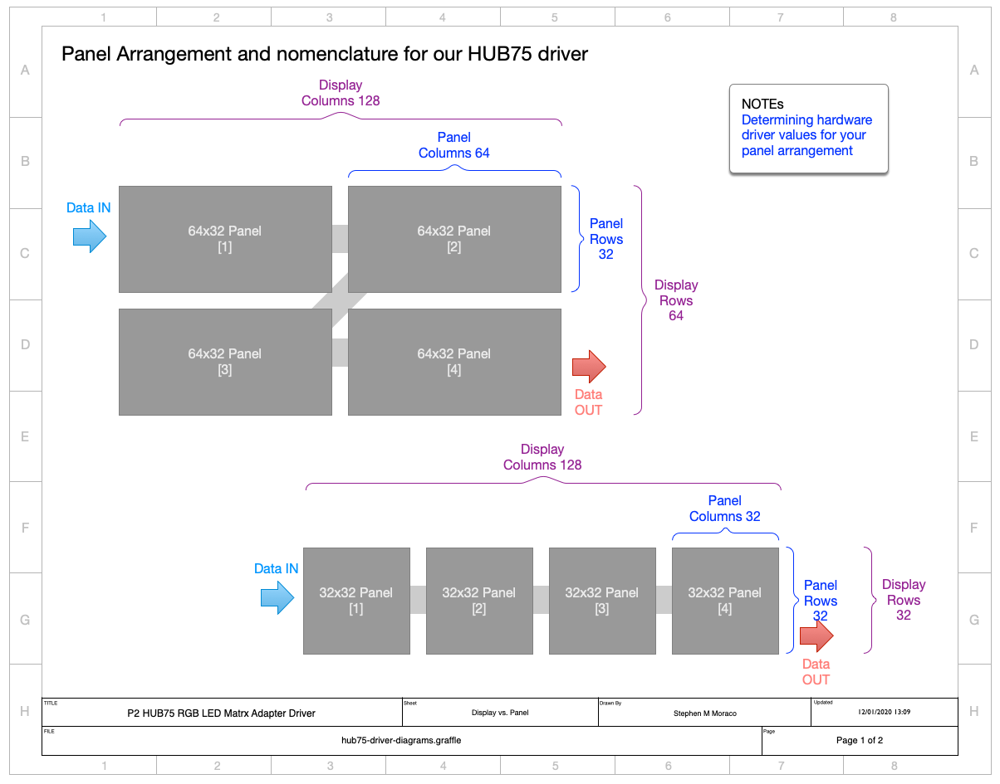
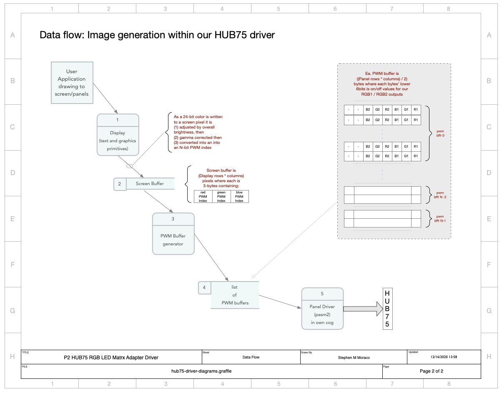
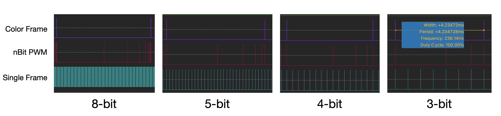
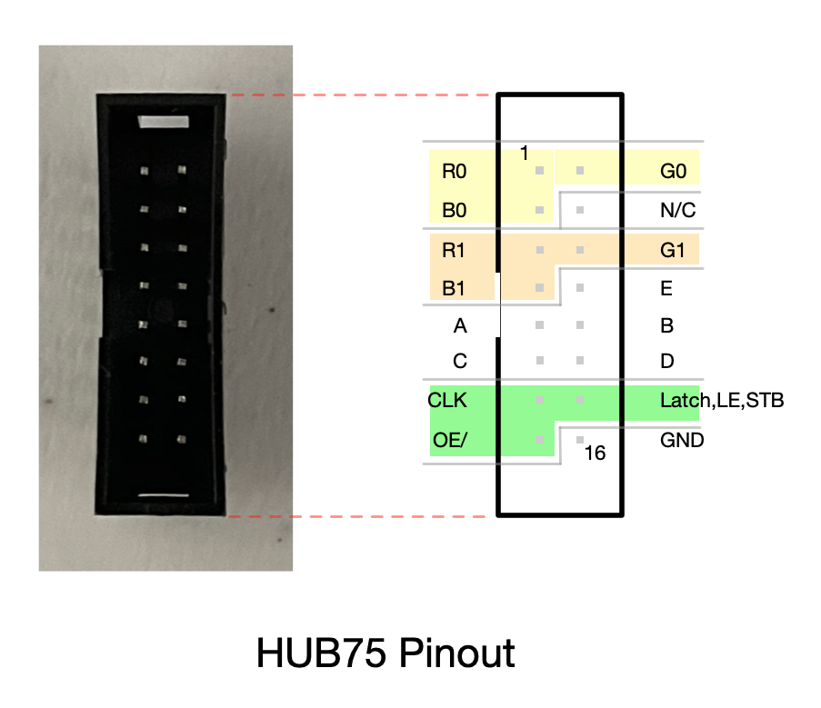

# Theory of Operations:
## Hub75 RGB LED Matrix panel driver

![Project Maintenance][maintenance-shield]

On this page you'll learn what files make up the driver (and/or come with it) and what their purpose is, how to configure the driver for your hardware, and also a bit about how the driver actually works. The step-by-step account of the driver's mechanism is the [Theory of Operations](DOCs/TheoryOfOperations.md).

(*I expect that this file will continue to grow over time as our driver becomes more capable. -Stephen*)


### Pages: [README](README.md) | [Hardware Turn-on](HardwareTurnon.md) | Driver Details | [Wiring Guide](DOCs/WiringGuide.md) | [Change Log](ChangeLog.md)

Within this page:

- [Driver Files](#driver-file-organization) - the purpose of each file found in the driver
- [Glossary](#glossary) - the terms every driver document uses, each defined once
- [Configuring the Driver](#configuring-the-driver) - how to describe your panels to the driver
- [Notes on Internals](#notes-on-driver-internals) - how a draw reaches the panels, and how the panels are refreshed
- [Max Panels Supported](#driver-max-panels-supported) - I'm planning on buying panels. How many panels does this driver support?


## Driver file organization

The driver files consist of demo-top-level files as well as the driver itself.

### Demo/Top-Level Files

Here are the reference programs you can study when learning to display to your panel(s):

| DEMO TopLevel Files            |  Purpose |
|-----------------|-------------|
| demo\_hub75_color.spin2 | Presents the color features of the panel driver, displays a .bmp file |
| demo\_hub75_text.spin2 | Presents the text and scrolling features of the panel driver |
| demo\_hub75_7seg.spin2 | Presents a technique for doing multi-step animations using the panel driver |
| demo\_hub75_multiPanel.spin2 | Presents panel-centric drawing (panel fills, labels, scrolling text across panels) on a six-panel display laid out as an unfolded cube; its panel names are labels only. For the faces of a real cube use the face-centric calls (`drawFace...`) |
| demo\_hub75_5x7font.spin2 | Presents pages (every 10 sec) showing the 5x7 full character-set font |
| demo\_hub75_scroll.spin2 | Shows off the 4 supported text-scrolling directions |
| demo\_hub75_colorPad.spin2 | **TEST** Simple single-screen demo so you can check if Red Green Blue LEDs are configured correctly. (*color patch will match color name underneath if settings for color-swap are correct*) |
| demo\_hub75_numberPanels.spin2 | **IDENTIFY** Labels every panel with its cable position, its panel position and an arrow, so you can fill in and confirm your wiring sentences |
| demo\_hub75_boundary.spin2 | **TEST** Draws once across panel seams (a crosshair, a spanning box, a circle, text across a seam) and a panel-centric line that is clipped at its panel's edge, then holds the image |
| demo\_hub75_quadPanel.spin2, demo\_hub75_multi2x2panel.spin2 | Draw to a 2x2 display and to its individual panels |

**NOTE:** these demo's are built for 64x32 panels and 64x64 panels. You may need to modify them if your panel is a different geometry.

### Test and bring-up top-level files

These are compile entry points for checking the driver and your hardware; they are not driver files and not demos:

| Top-level file | Purpose |
|-----------------|-------------|
| test\_hub75\_cube\_fold.spin2 | Cube fold self-test: runs with no panels attached and prints PASS or FAIL for each case |
| test\_hub75\_rates.spin2 | Runs a fixed workload on one adapter with the instrument and reports refresh, lit share, clock, commit and draw time; runs the frame-set handshake and take checks, the brightness steps, the colour-table and row-run self-tests |
| test\_hub75\_converter.spin2 | Compares the screen-to-PWM converters with a reference converter byte for byte, with no panels attached, and prints PASS or FAIL |
| test\_hub75\_oe\_bcm.spin2 | Stand-alone check of the output-enable-weighted refresh method on one adapter, with test patterns and monitors |
| test\_hub75\_pin\_identify.spin2 | Pin identification: toggles the HUB75 pins at known frequencies so you can tell which pin is which |
| isp\_hub75\_anlyCheck.spin2 | Pin exerciser: toggles the HUB75 board's pins so you can verify logic analyzer connections and wiring |

### Driver files

The driver itself is composed of the following files (with a few extras thrown in for fun):

| group / Driver File           |  Purpose |
|-----------------|-------------|
| **- User Configuration -** | |
| isp\_hub75_hwPanelConfig.spin2 | USER MODIFIED configuration: compile-time constants, describe the panels attached to each hub75 adapter (chip, size, color depth, mounting, refresh target, and the wiring sentences) |
| isp\_hub75_hwBufferAccess.spin2 | Core - reads your wiring sentences at startup, checks them, derives the display's layout, builds the cell address tables the drawing paths read, and holds the small per-adapter tables and the scrolling window watch. **Not edited per setup** |
| isp\_hub75_hwBuffers.spin2 | Core - the large buffers for all three adapters, each sized from that adapter's panel count (zero length for an adapter with no panels). **Not edited per setup** |
| **- Core Driver -** | |
| isp\_hub75_color.spin2 |  Core - Color constants |
| isp\_hub75_colorUtils.spin2 |  Core - Color translation routines and each adapter's color table |
| isp\_hub75_display.spin2 | Core - the display API: text, lines, boxes, circles, scrolling, brightness and the commit of the screen buffer to the panels |
| isp\_hub75_fonts.spin2 | Core - fonts for text support: a 5x7 font, two 8x8 variants, and two dithered 5x7 fonts |
| isp\_hub75_cube.spin2 | Core - the cube layer: folds a six-panel net into a cube and carries face coordinates across its 12 edges |
| isp\_hub75_hwEnums.spin2 | Core - enumerations for panel, panel connection description, and the words of the wiring sentences |
| isp\_hub75_panel.spin2 | Core - the layer converting the screen buffer into PWM frame sets and posting them to the refresh cog |
| isp\_hub75_rgb3bit.spin2 | Core - the PASM Hub75 refresh cog |
| isp\_hub75_screenUtils.spin2 | Core - pixel-level drawing primitives: single pixels, row and column runs, glyph blocks, scroll moves and the plot context writer |
| isp\_hub75_scrollingText.spin2 | Core - scrolling text regions (the display object holds four of them) |
| **- Extras -** | |
| isp\_hub75\_display_bmp.spin2 | **Optional** - load .bmp file content into screen buffer |
| isp\_hub75_7seg.spin2 | **Optional** - part of 7-segment demo - a digit (packaged with the demos) |
| isp\_hub75_segment.spin2 | **Optional** - part of 7-segment demo - a segment within a digit (packaged with the demos) |
| isp\_hub75\_instrument.spin2 | **Test only** - measurement: monitor smart pins on CLK, /OE, LATCH and the refresh cog's strobes, plus stopwatches. Compiled only with `HUB75_INSTRUMENT` defined by a test top file (see [Author Test Configurations](DOCs/AuthorTestConfigurations.md)) |

The structure of these files was chosen in order to (1) make it easier and less memory usage for part of the driver to access other parts and (2) make it easier for you to chose to compile the **optional** parts or not. 

Now let's see how to configure the driver.


## Glossary

Every driver document uses these terms, with exactly these meanings. Each term is defined here, and only here; other documents link to this section.

### adapter

The HUB75 adapter card. Adapter IDs are `HUB75_ADAPTER_1` through `HUB75_ADAPTER_3`, counting from 1. **Adapter *k* drives display *k*-1**: `HUB75_ADAPTER_1` drives the display configured by the `DISP0_` settings, `HUB75_ADAPTER_2` drives `DISP1_`, and `HUB75_ADAPTER_3` drives `DISP2_`.

### display

All the panels on one adapter, drawn on as one surface. Each display is configured by its own group of settings, `DISPn_`, counting from 0 (`DISP0_`, `DISP1_`, `DISP2_`).

### display coordinates

A (row, column) position on the display, with the origin (0, 0) at the top-left. For a rotated display, the origin is the top-left of the display **as mounted**: the corner the viewer sees as top-left.

### panel position

A panel's place in the display, numbered `P0`, `P1`, ... in reading order: left to right along the top row of panels, then each row below in turn, counting only the cells that hold a panel. `P0` is the top-left panel.

### panel coordinates

A (row, column) position within one panel, as the viewer sees it, with the origin (0, 0) at the panel's top-left.

### cable position

A panel's place along the ribbon cable, counted from the adapter: `C0` is the panel the adapter plugs into, `C1` is the next panel along the cable, and so on.

### buffer slot

The driver's internal order of panels within its buffers. Slot 0 is the panel at the far end of the cable, so for a display of N panels, a panel at cable position C occupies slot N-1-C. Buffer slots are used only inside the driver's mapping layer and its comments; configuration and drawing never use them.

### native coordinates

A pixel's (row, column) as the panel's own driver chips address it, before panel rotation is applied.

### panel rotation

How one panel is mounted within the display, written as the direction the panel's identify arrow points: `ARROW_UP`, `ARROW_DOWN`, `ARROW_LEFT` or `ARROW_RIGHT`. A panel whose arrow points down is mounted at 180°.

### display rotation

How the whole assembled display is mounted, set by `DISPn_ROTATION`. Display rotation applies to flat displays only; it does not apply to a cube.

### wiring

The per-panel sentences `DISPn_C0` through `DISPn_C15`, one for each cable position. Each sentence describes the panel at that cable position: where it sits relative to a panel already placed, and its panel rotation. The full grammar is in the [wiring guide](DOCs/WiringGuide.md#the-wiring-sentences).

### face

One panel of a cube display, named `TOP`, `BOTTOM`, `FRONT`, `BACK`, `LEFT` or `RIGHT`. The face names are derived from the two cube orientation settings. The cube section of the wiring guide covers faces, folding and corners in full.

### cube orientation

How a cube display is mounted, set by `DISPn_CUBE_TOP` and `DISPn_CUBE_FRONT`: the cable positions of the panels that form the top face and the front face. The front face must share an edge with the top face. Cube orientation takes the place of display rotation for a cube.

### face coordinates

A (face, row, column) position on a cube display. Row and column may run past the edge of the face; a pixel that does is carried across the edge onto the neighbouring face. Each face's up direction is fixed: the four side faces' up points toward `TOP`, the top face's up points toward `BACK` (so text on the top face reads correctly when viewed from the front), and the bottom face's up points toward `FRONT`.

### cell

One position in the display's grid of panels, one panel in size as the viewer sees it. A cell either holds a panel or is empty (the hole in an L-shaped display). The driver's cell address tables have one entry per cell.

### bit plane

One bit of the color depth, for every pixel of the display. A display at 8-bit color depth has eight bit planes; plane 0 is the most significant bit.

### frame set

The bit planes of one whole image, in the form the refresh cog shifts out: one frame per bit plane, plane 0 first. Each adapter has two frame sets; one is on display while a commit converts the next image into the other.

### scan

A panel's scan is written **1/S scan**, where S is the number of row addresses its address lines select. Each address lights several rows at once: **panel rows ÷ S**. For example:

| Panel | Address lines | Scan | Rows lit at once |
|---|---|---|---|
| 64×32 | `ADDR_ABCD` (16 addresses) | 1/16 scan | 2 |
| 64×64 | `ADDR_ABCDE` (32 addresses) | 1/32 scan | 2 |
| 64×32 | `ADDR_ABC` (8 addresses) | 1/8 scan | 4 |

Most panels light two rows at once, one fed by each set of color pins. A panel that lights **four** rows at once, such as a 64×32 1/8-scan panel, needs its rows placed differently in the frame set; the driver does that when the panel's chip flags include `SCAN_4`, using the same converter as every other panel (`convertRowPairs()`) (called *quarter-scan* elsewhere, after the code's `SCAN_4` and `bScan_1_4`; "four rows at once" is what it means, not 1/4 of the panel).


## Configuring the driver

How the panels are arranged, cabled and rotated is described by the wiring sentences; the [Wiring Guide](DOCs/WiringGuide.md) covers them, the identify screen, rotation, the cube and the driver limits, with seven worked examples.

To this driver the panels look like the following:

**NOTE:** the driver supports single panels, horizontal/vertical multi-panel chains, 2-D panel grids of any shape you can cable (a 2x2, 3x2, an L, ...), and a six-panel cube, each panel with its own up (its arrow). Multi-panel behavior continues to be proven for some driver chips (see the [Change Log](ChangeLog.md) Known Issues).



**Figure 1**: Terms describing a display composed of matrix panels cabled together.

In the above image you see panels describe in terms of rows and columns, and you also see the overall display described in rows and columns but comprised of multiple panels in some arrangement.  The configuration settings following are intended to describe the geometry of your display to the driver.  The organization you describe in these settings causes the underlying driver to allocate buffer space tailored to your display and conditions the hub75 signalling to work correctly for your display. Additionally, if your panels use certain chips the signalling will be changed to conform to what those chips need to work.

Once you have the driver source files added to your project you will first need to configure the driver by modifying the following values in the file **isp\_hub75_hwPanelConfig.spin2** for each HUB75 adapter that you will be activating in your project:

The settings, their defaults and what each means are in the table of [Driver Constants used for configuration](README.md#driver-constants-used-for-configuration) in the README. That table is the one place the settings are listed. In it, `DISPx_C0` ... `DISPx_C15` are the [wiring](#wiring) sentences, `DISPx_ROTATION` is a [display rotation](#display-rotation), `DISPx_SHAPE` says flat or cube, `DISPx_CUBE_TOP` and `DISPx_CUBE_FRONT` set the [cube orientation](#cube-orientation), and `DISPx_TARGET_REFRESH_HZ` is the refresh rate to aim for.

Not set by you, worked out at startup from the sentences: the number of panels (`DISPx_PANEL_COUNT`, counted at compile time from the `NO_PANEL` entries; it sizes the buffers), the display's size in pixels, its grid of panels, and each panel's place, buffer slot and rotation. The driver prints them as a picture of the grid; the [Wiring Guide](DOCs/WiringGuide.md#what-a-good-config-prints) explains it.

**NOTE**: the DISPx_ is a place holder for DISP0\_\*, DISP1\_\* and DISP2\_\* constants indicating the 1st, 2nd, and 3rd HUB75 cards.

Each adapter you use is started by one call, `display.start(display.HUB75_ADAPTER_n)`, which checks the sentences, derives the layout, builds the cell address tables and the adapter's color table, hands the adapter its buffers and starts its refresh cog. (`display.startWithId()` is the same call with a debug instance number, for programs that start more than one adapter.) Nothing in `isp_hub75_hwBufferAccess.spin2` or `isp_hub75_hwBuffers.spin2` is edited to add an adapter.

## Notes on driver internals

Here's a quick diagram you can use to gain a general understanding of how this driver operates:



**Figure 2**: Flow of data within the driver. (The figure shows the stored color values; brightness is applied by the refresh core as /OE time, not when a pixel is written.)

Basically, this image shows that the user code draws in 24-bit color values. The drawing calls look up where each pixel goes in the screen buffer (one lookup in a table built at startup from your wiring sentences) and write it there, three bytes per pixel, after one read of the adapter's color table per channel (gamma if enabled, then the color depth). When the screen is committed (the image is transferred to the display) the screen buffer is split out into individual PWM buffers, one bit-plane frame for each bit of the color depth (together, a frame set). The commit converts into whichever of the adapter's two frame sets is not on display and posts it; the refresh core takes the posted set at the start of its next frame, so the panels never show a half-converted image. Brightness is not one of the steps in the figure: it is /OE time, applied by the refresh core, and it does not change the values stored.

A drawing call reaches the panels in these steps. The [Theory of Operations](DOCs/TheoryOfOperations.md#2-data-flow) describes each in detail:

1. **At startup** (`display.start()`), `isp_hub75_hwBufferAccess.spin2` decodes and checks your wiring sentences, derives the grid and its lookup tables, and from them builds the **cell address tables**: for each [cell](#cell) that holds a panel, the screen-buffer offset of the cell's first pixel and the signed steps to the pixel at its right and the pixel below it. They are worked out once, from one rule (display rotation, then the panel's place, rotation and buffer slot), so no drawing call works the rule out again.
2. **A pixel write** looks its address up in those tables. **Runs** of pixels (lines, box rows and columns, glyph rows, BMP rows, fills) take one start address and step per cell and are written in PASM by `fillRowRun`, `fillColumnRun` and `copyRowRun` in `isp_hub75_screenUtils.spin2`. A glyph that lies inside one cell is one block, its rows written in one PASM call. Sloped lines and circles in one color plot every pixel through one **plot context** (the tables' addresses, handed to PASM once per shape).
3. **Scrolling text moves the last frame.** A scrolling region watches its window in the screen buffer; when nothing else has drawn there and the next step is one pixel on, it moves the pixels it drew last time one place in PASM and draws only the new edge column or row. A program that writes the screen buffer directly, past the driver's calls, calls `hub75Bffrs.noteAllDrawn(chain)` afterwards so every watched window is drawn in full on its next step.
4. **The commit** (`display.commitScreenToPanelSet()`) converts the screen buffer into the idle frame set with an inline-PASM converter (`convertRowPairs()` in `isp_hub75_panel.spin2`) and posts it. It waits first if the refresh core has not yet taken the previous post.
5. **The refresh core** (`isp_hub75_rgb3bit.spin2`) runs continuously: at each frame start it takes the posted set and reads the brightness; then, for each row address and each bit plane, it loads the plane's row into cog RAM, shifts it into the panels, latches it and lights it.

The refresh core shows each bit plane once per row address and lights it for a time proportional to its bit weight, by pulsing the panel's output-enable (/OE) line (a smart pin in pulse mode) for 2^*k* units. This is binary-coded (bit-angle) modulation with output-enable weighting, a widely used way to drive these panels. How often every row address has been shown with every plane is the refresh rate. You set the rate you want with `DISPx_TARGET_REFRESH_HZ` (default 60 Hz); the driver picks the brightest /OE unit that reaches it. Brightness (`display.setBrightness()`, 0 to 256, one value for every adapter) shortens the lit part of each plane's slot and leaves the slot, and so the refresh rate, as it was. The method, the target rule, the measured rates and the brightness floor are in the [Wiring Guide's refresh rate section](DOCs/WiringGuide.md#refresh-rate).

The PASM2 HUB75 driver derives its signal timing from the configured system clock (`_clkfreq`) rather than assuming a fixed frequency. This clock-frequency-independent timing means a demo can change its `_clkfreq` and the panel CLK/latch/blanking pulses continue to meet the panel's timing requirements without hand-tuning the driver. Each half of the CLK pulse is held to at least 20 ns, and the whole period to the highest clock the chip allows: its rated clock or, when lower, its chain limit (the delay from one chip's CLK to its SDO plus the next chip's SDI setup time). A chip with no rating in the driver's table is held to 20 MHz, and the driver says so at startup. For the MBI5124GP the chain limit is 18.9 MHz, so at 335 MHz its panels are clocked at 18.6 MHz. The ratings are in the [Chip Characteristics Matrix](DOCs/ChipCharacteristicsMatrix.md#datasheet-clock-and-oe-ratings).

Each adapter's buffers are sized at compile time from the panels its wiring sentences name: a pixel takes 3 screen-buffer bytes plus one byte per bit of color depth for the two PWM frame sets (11 bytes at 8-bit). The [Wiring Guide](DOCs/WiringGuide.md#driver-limits) gives the hub RAM each display needs and the most panels one adapter can drive.

A compile-time color depth setting (`DISPx_COLOR_DEPTH`, 3 to 8 bits) specifies how rich the colors are to be for your display; the default is 8-bit (full 24-bit color).

The PWM Frame-set consists of one plane for each bit in the color depth. The following diagram shows the constituent frames being displayed with the MSBit being displayed for the longest period and the LSBit for the shortest. Each plane's lit time is its power-of-2 weight: in 3-bit the MSBit is lit 2^2 or 4 units, the next bit 2^1 or 2 units and the LSBit 1 unit.



**Figure 3**: Creating a full color frame.

### Diagnostic build switches

The driver keeps a set of low-level diagnostic routines (PWM frame / buffer memory dumps) that are normally compiled **out** so they add zero cost to release builds. They are gated by the `DBG_PWM` preprocessor symbol and revived by passing it on the compiler command line:

```
pnut-ts -d -D DBG_PWM demo_hub75_color.spin2     # PWM-frame dump diagnostics compiled in
pnut-ts -d            demo_hub75_color.spin2     # normal build -- diagnostics absent (zero cost)
```

`-D` is global across the object tree, so a single `-D DBG_PWM` reaches `isp_hub75_panel.spin2` (the `dumpBufferHeads` / `dumpFrame*` family) and `isp_hub75_hwBufferAccess.spin2` (`dbgMemDump`). Two notes for maintainers:

- Use `#ifdef DBG_PWM` / `#endif` (conditional compilation) to gate diagnostic **methods and their call sites** -- this removes the routine scaffolding entirely. (A plain `debug()` statement already costs nothing in a non-`-d` build, so it needs no guard.)
- An in-file `#define` does **not** cross object boundaries; only command-line `-D` does. Define `DBG_PWM` on the command line, never per-file.


## Driver Max panels supported

The number of panels one adapter can drive depends on the **panel type**, and is counted in panels, not pixels. Two limits apply:

- **The refresh line buffer.** The refresh core holds one row of the whole chain, 512 column clocks. Max panels per adapter is 512 / (panel columns x scan factor), never more than 16, where the scan factor is 2 for the chips the driver flags `SCAN_4` (see [scan](#scan)) and 1 for every other chip. For example, 8 panels of 64 columns, or 4 panels of 128 columns. The driver checks this at startup and prints a message if your display is over it. This is the limit on every panel type for a single adapter. A panel's width (`DISPx_MAX_PANEL_COLUMNS`) must also be a multiple of 4, as every common panel is (32, 64, 80, 128); startup stops with a message otherwise.
- **Hub RAM**, shared by all three adapters. One panel of P pixels at color depth N takes P x (3 + N) bytes for its screen buffer and two PWM frame sets. The compiler stops with `Program requirement exceeds 512KB hub RAM by N bytes` when the buffers do not fit.

The table of limits for every panel type the author has tested, with the arithmetic, the RAM figures and the refresh rates, is in the [Wiring Guide's driver limits](DOCs/WiringGuide.md#driver-limits). Those limits are calculated from the driver's constants; only the author's rig (four ICN2037 128x64 panels) is measured.

Generally you can make a single display out of many panels, with panels ranging from p1.5 to p10 (1.5mm to 10mm led center-to-center); such displays could be quite large and of course will draw many amps of 5V. ;-)

**NOTE**: The driver supports using 1-3 HUB75 adapters. This means you can have up to three chains of panels attached to one P2. Each adapter has its own line buffer limit, but all three adapters share the hub RAM, so the buffers of every adapter together must fit.

**NOTE2**: If you have panels by different vendors  (different driving ICs) you can use multiple HUB75 cards to accomodate this. Just make sure you have all panels of a given IC type on a single chain. Put all the panels with the next IC type on the next chain, the next HUB75 adapter.  Drive all the chains from the single P2.

### Research Needed

One of my upcoming efforts is to review in detail how the driver uses RAM. I'll look into:

- using the LUTs 
- using the EDGE on board RAM 
- fine tuning how the driver allocates RAM

My hope would be that I'll find that using one or more of these approaches will reduce our RAM usage even further.

## Notes on HUB75 pins used by driver

Our P2 Eval HUB75 Adapter board is built to drive up to 5 address pins (A-E) so we can drive many HUB75 panel variants.

The adapter sits on one 16-pin group (`PIN_GROUP_P0_P15`, `PIN_GROUP_P16_P31` or `PIN_GROUP_P32_P47`). The refresh cog drives the pins at these offsets from the group's first pin: CLK +0, /OE +1, LATCH +2, row address A to E +3 to +7, and the six color pins R1 G1 B1 R2 G2 B2 +8 to +13.

Here's a simple diagram showing related pin groups:




---

*If you have any questions about what I've written here, file an issue and I'll respond with edits to this doc to attempt to make things more clear.*

Thanks for Reading, following along. I look forward to seeing what adaptations you come up with. Please let me know when you do!

```
Stephen M. Moraco
Lead developer
Iron Sheep Productions, LLC.
```

> If you find this kind of written explanation useful, helpful I would be honored by your helping me out for a couple of :coffee:'s or :pizza: slices -or- you can support my efforts by contributing at my Patreon site!
>
> [](https://www.buymeacoffee.com/ironsheep) &nbsp;&nbsp; -OR- &nbsp;&nbsp; [](https://www.patreon.com/IronSheep?fan_landing=true)[Patreon.com/IronSheep](https://www.patreon.com/IronSheep?fan_landing=true)

---

Last Updated: 09 Oct 2026

[maintenance-shield]: https://img.shields.io/badge/maintainer-stephen%40ironsheep.biz-blue.svg?style=for-the-badge
