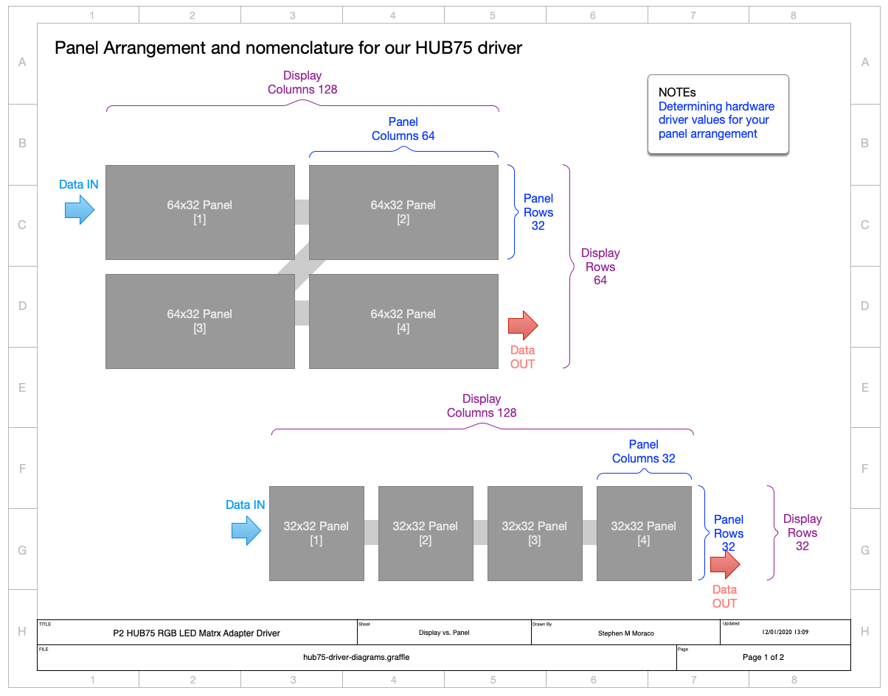

# Theory of Operations:
## Hub75 RGB LED Matrix panel driver

![Project Maintenance][maintenance-shield]

On this page you'll learn what files make up the driver (and/or come with it) and what their purpose is, how to configure the dirver for your hardware, and also a bit about how the driver actually works. 

(*I expect that this file will continue to grow over time as our driver becomes more capable. -Stephen*)


### Pages: [README](README.md) | [Hardware Turn-on](HardwareTurnon.md) | Driver Details | [Change Log](ChangeLog.md)


## Driver file organization

The driver files consist of demo-top-level files as well as the driver itself.

### Demo/Top-Level Files

Here are the reference programs you can study when learning to display to your panel(s):

| DEMO TopLevel Files            |  Purpose |
|-----------------|-------------|
| isp\_hub75_demoColor.spin2 | Presents the color features of the panel driver |
| isp\_hub75_demoText.spin2 | Presents the text and scrolling features of the panel driver |
| isp\_hub75_demo7seg.spin2 | Presents a technique for doing multi-step animations using the panel driver |

**NOTE:** these demo's are built for a 64x32 panel. You may need to modify them if your panel is a differnt geometry.

### Driver files

The driver itself is composed of the following files (with a few extras thrown in for fun):

| group / Driver File           |  Purpose |
|-----------------|-------------|
| **- User Configuration -** | |
| isp\_hub75_hwGeometry.spin2 | USER MODIFIED configuration file |
| **- Core Driver -** | |
| isp\_hub75_color.spin2 |  Core - Color constants, translation, routines, etc. |
| isp\_hub75_display.spin2 | Core - the drawing primitives and screen buffer |
| isp\_hub75_fonts.spin2 | Core - fonts for text support |
| isp\_hub75_panel.spin2 | Core - the layer translating screen buffer to PWM buffers |
| isp\_hub75_rgb3bit.spin2 | Core - the PASM Hub75 driver |
| isp\_hub75_screenAccess.spin2 | Core - light-weight access to Screen Buffer |
| isp\_hub75_screenUtils.spin2 | Core - non-panal drawing primitives |
| **- Extras -** | |
| isp\_hub75\_display_bmp.spin2 | **Optional** - load .bmp file content into screen buffer |
| isp\_hub75_scrollingText.spin2 | **Optional** - adds Scrolling Text |
| isp\_hub75_7seg.spin2 | **Optional** - part of 7-segment demo - a digit |
| isp\_hub75_segment.spin2 | **Optional** - part of 7-segment demo - a segment within a digit |

The structure of these files was chosen in order to (1) make it easier and less memory usage for part of the driver to access other parts and (2) make it easier for you to chose to compile the **optional** parts or not. 

Now let's see how to configure the driver.


## Configuring the driver

To this driver the panels look like the following:

**NOTE:** keep in mind, we only support a single panel for this first release. Multi-panel is in progress and will be release shortly!



**Figure 1**: Terms describing a display composed of matrix panels cabled together.

In the above image you see panels describe in terms of rows and columns, and you also see the overall display described in rows and columns but comprised of multiple panels in some arrangement.  The configuration settings following are intended to describe the geometry of your display to the driver.  The organization you describe in these settings causes the underlying driver to allocate buffer space tailored to your display and conditions the hub75 signalling to work correctly for your display. Additionally, if your panels use certain chips the signalling will be changed to conform to what those chips need to work.

Once you haave the driver source files added to your project you will first need to configure the driver by modifying the following values in the file **isp\_hub75_hwGeometry.spin2**:

| Name            | Default | Description |
|-----------------|-------------|-------------|
| `ADAPTER_BASE_PIN` | PINS\_P16_P31 |  Identify which pin-group your HUB75 board is connected |
| `PANEL_DRIVER_CHIP` | CHIP_UNKNOWN | in most cases UNKNOWN will work. Some specialized panels need a specific driver chip (e.g., those using the FM6126A) |
| `MAX_PANEL_COLUMNS` | {none} | The number of LEDs in each row of your panel ( # pixels-wide) |
| `MAX_PANEL_ROWS` | {none} | The number of LEDs in each column of your panel ( # pixels-high) |
| `PANEL_ADDR_LINES` | {none} | The number of Address lines driving your panels (ADDR\_ABC, ADDR\_ABCD, or ADDR\_ABCDE) |
| `MAX_DISPLAY_COLUMNS` | {none} | The number of LEDs in each ROW of your multi-panel display |
| `MAX_DISPLAY_ROWS` | {none} | The number of LEDs in each COLUMN of your multi-panel display |
| `COLOR_DEPTH` | {none} | The color depth you wish to display on your panels (compile-time selectable from 3-bit to 8-bit) |

## Notes on driver internals

Here's a quick diagram you can use to gain a general understanding of how this driver operates:


**Figure 2**: Flow of data within the driver.

Basically, this image shows that the user code draws in 24-bit color values. As these are written to the screen buffer they are translated into PWM values. WHen the screen is committed (the image is transferred to the display) the screen image is split out into individual PWM buffers one for each of the 16 sub-frames which together comprise one full color video frame being displayed at roughtly 60 fps.

The storage format is shown in the diagram at the various points of translation.

Another view we'll later be adding to this page is how we allocate and use memory for these buffers as our display sizes change (these sizes are what you configured before you compiled the driver.)  This is only now being decided as we begin to add the multi-panel support.

## Notes on HUB75 pins used by driver

Our P2 Eval HUB75 Adapter board is built to drive up to 5 address pins (A-E) so we can drive many HUB75 panel variants.

Here's a simple diagram showing related pin groups:


---

*If you have any questions about what I've written here, file an issue and I'll respond with edits to this doc to attempt to make things more clear.*

Thanks for Reading, following along. I look forward to seeing what adaptations you come up with. Please let me know when you do!

```
Stephen M. Moraco
Lead developer
Iron Sheep Productions, LLC.
```

If you find this kind of written explanation useful, helpful I would be honored by your helping me out for a couple of :coffee:'s or :pizza: slices!

[](https://www.buymeacoffee.com/ironsheep)

---

Last Updated: 02 Dec 2020, 00:58 MST

[maintenance-shield]: https://img.shields.io/badge/maintainer-stephen%40ironsheep.biz-blue.svg?style=for-the-badge
